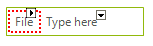
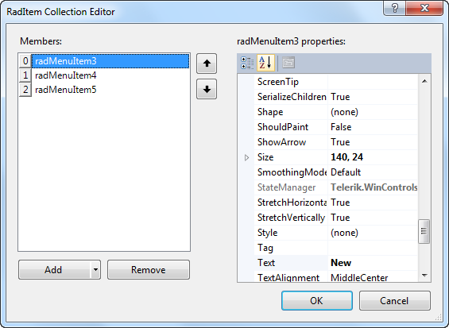
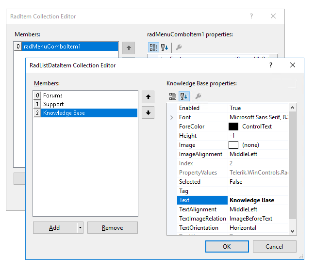
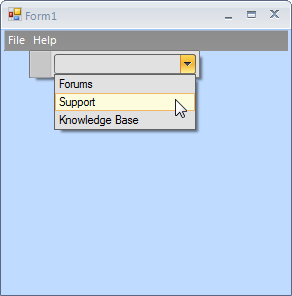

# Getting Started


## 

The following tutorial demonstrates creating a RadMenu with standard menu items with shortcuts, ComboBox menu elements and also shows how to apply a theme to RadMenu.

1\. Drag a __RadMenu__ control from the toolbox to a form.
            

2\. Click in the area labeled __Type Here__ and type "File".
              

3\. Press __Enter__.<br /> 

4\. Click in the area labeled __Type Here__ and type "Help".
            

5\. Press __Enter__.
            

6\. Drag Office2010Black theme component from your ToolBox to your form.
            

7\. Select the __RadMenu__ control.
            

8\. Set the __ThemeName__ property to __Office2010Black__.
            

9\. Select the "File" menu item.
            

10\. In the __Properties__ window, click in the __Items__ property.
            

11\. Click the ellipsis button.
            

12\. In the __RadItem Collection Editor__, click the drop-down arrow on the __Add__ button. Select the __RadMenuItem__.
            

13\. Set the __Text__ property of the new __RadMenuItem__ to "New".<br/>

14\. Add two more RadMenuItems. Set their __Text__ properties to "Open" and "Save".
            

15\. Click __OK__.
            

16\. Select the "Help" menu item.
            

17\. In the __Properties__ window, click in the __Items__ property.
            

18\. Click the ellipsis button.
            

19\. In the __RadItem Collection Editor__, click the drop-down arrow on the __Add__ button. Select the __RadMenuComboItem__.
            

20\. Clear the __Text__ property of the new RadMenuComboItem.
            

21\. Expand the __ComboBoxElement__ property of the RadMenuComboItem.
            

22\. Click in the __Items__ property of the ComboBoxElement.
            

23\. Click the ellipsis button.
            

24\. In the __RadListDataItem Collection Editor__, click the __Add__ button.
            

25\. Set the __Text__ property of the new RadComboBoxItem to "Forums".
 
26\. Add two more RadComboBoxItems. Set their __Text__ properties to "Support" and "Knowledge Base".<br/>

27\. Click __OK__ to close the RadListDataItem Collection Editor.
            

28\. Click __OK__ to close the RadItem Collection Editor.
            

29\. In order to assign a shortcut to a RadMenuItem, go to the Code View of the form and set the Ctrl+N shortcut to the 'New' menu item. 

{{source=..\SamplesCS\Menus\Menu\MenuGettingStarted.cs region=shortcut}} 
{{source=..\SamplesVB\Menus\Menu\MenuGettingStarted.vb region=shortcut}} 

````C#
radMenuItem3.Shortcuts.Add(new Telerik.WinControls.RadShortcut(Keys.Control, Keys.N));

````
````VB.NET
RadMenuItem3.Shortcuts.Add(New Telerik.WinControls.RadShortcut(Keys.Control, Keys.N))

````

{{endregion}} 

30\. Go to the Design View of the form and select the 'New' menu item.
            

31\. In the __Properties__ window, click the events toolbar button.
            

32\. Double-click the __Click__ event.
            

33\. Replace the automatically-generated event handler with this code:

{{source=..\SamplesCS\Menus\Menu\MenuGettingStarted.cs region=clickHandler}} 
{{source=..\SamplesVB\Menus\Menu\MenuGettingStarted.vb region=clickHandler}} 

````C#
private void radMenuItem3_Click(object sender, EventArgs e)
{
    MessageBox.Show("New File");
}

````
````VB.NET
Private Sub RadMenuItem3_Click(ByVal sender As System.Object, ByVal e As System.EventArgs) Handles RadMenuItem3.Click
    MessageBox.Show("New File")
End Sub

````

{{endregion}} 

34\. Return to the Design View of the form.

35\. Press __F5__ to run the project. Notice the menu styling, the use of Ctrl+N to trigger the message box, and the combo box in the Help menu. </br>
