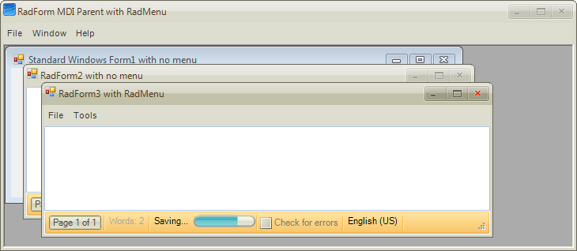

# Menu Merge in MDI applications

## 

RadMenu automatically discovers that it is placed in a child MDI form. When a child MDI form is maximized, RadMenu automatically merges the Menu items in the parent form using the MergeType and MergeOrder properties defined for each RadMenuItem. When a child form is restored/minimized, the parent menu state is restored.

Please refer to the next [section]() about MergeType and MergeOrder properties.
