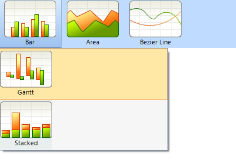
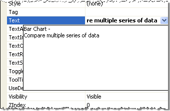

# Multi-Line Menu Item Text


## 

The __Text__ for __RadMenuItem__ can be displayed on multiple lines as shown in the screenshot below. <br>

In the Property Window for a __RadMenuItem__ use the drop down list to invoke the editor for multiple lines. __Ctrl-Shift__ creates a new line in the editor.  __Ctrl-Enter__ accepts changes and closes the editor. __Esc__ cancels changes and closes the editor. <br>

In code use __Environment.NewLine__ to separate strings:

{{source=..\SamplesCS\Menus\Menu\MenuForm.cs region=multiline}} 
{{source=..\SamplesVB\Menus\Menu\MenuForm.vb region=multiline}} 

````C#
radMenuItem1.Text = "Bar Chart - " +
 Environment.NewLine +
 "Compare multiple series of data";

````
````VB.NET
radMenuItem1.Text = "Bar Chart - " & Environment.NewLine & "Compare multiple series of data"

````

{{endregion}} 

## Menu Item Height

The __AllItemsEqualHeight__ property controls whether the RadMenu allows some menu items to be taller than others. By default, menu items with multiple lines of text are taller than menu items with single lines of text. If you set this property to True, the height of all items increases to match that of the tallest items.

{{source=..\SamplesCS\Menus\Menu\WorkingWithRadMenuItems\MultilineMenuItemText.cs region=Height}} 
{{source=..\SamplesVB\Menus\Menu\WorkingWithRadMenuItems\MultilineMenuItemText.vb region=Height}} 

````C#
radMenu1.AllItemsEqualHeight = true;

````
````VB.NET
radMenu1.AllItemsEqualHeight = True

````

{{endregion}} 


