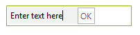

# Nesting Controls in Menu Items

## 

The __RadMenuContentItem__ is a container control that allows you to build up custom menu items from other controls. You can assign any RadElement based control to the __ContentElement__ property of a RadMenuContentItem. The example below demonstrates dynamically creating two main menu items that contain RadTextBox and RadButton elements. When the button is clicked a message box displays the text.

#### __[C#] Adding content items__

{{region nestingControls}}
	        void Form1_Load(object sender, EventArgs e)
	        {
	            RadTextBoxElement textBox = new RadTextBoxElement();
	            textBox.Text = "Enter text here";
	            textBox.MinSize = new Size(100, 0);
	            radMenu1.Items.Add(textBox);
	            RadButtonElement button = new RadButtonElement();
	            button.Text = "OK";
	            button.MaxSize = new Size(0, 20);
	            button.Click += new EventHandler(button_Click);
	            radMenu1.Items.Add(button);
	        }
	
	        void button_Click(object sender, EventArgs e)
	        {
	            RadTextBoxElement textBox = radMenu1.Items[0] as RadTextBoxElement;
	            MessageBox.Show("Text is: " + textBox.Text);
	        }
	{{endregion}}

#### __[VB.NET]  Adding content items__

{{region nestingControls}}
	    Private Sub Form1_Load(ByVal sender As Object, ByVal e As EventArgs)
	        Dim textBox As New RadTextBoxElement()
	        textBox.Text = "Enter text here"
	        textBox.MinSize = New Size(100, 0)
	        RadMenu1.Items.Add(textBox)
	        Dim button As New RadButtonElement()
	        button.Text = "OK"
	        button.MaxSize = New Size(0, 20)
	        AddHandler button.Click, AddressOf button_Click
	        RadMenu1.Items.Add(button)
	    End Sub
	
	    Private Sub button_Click(ByVal sender As Object, ByVal e As EventArgs)
	        Dim textBox As RadTextBoxElement = TryCast(RadMenu1.Items(0), RadTextBoxElement)
	        MessageBox.Show("Text is: " & textBox.Text)
	    End Sub
	{{endregion}}

