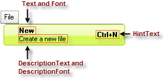

# RadMenuItem

The following controls are used to create a menu structure:

* RadMenuItem 

* RadMenuHeaderItem 

* RadMenuComboItem 

* RadMenuSeparatorItem 

* RadMenuContentItem 

## RadMenuItem

The RadMenuItem represents a standard menu item. Some of its properties include:

* __AutoSizeMode__ indicates how the menu item will be sized and can be __FitToAvailableSize__, __WrapAroundChildren__ or __Auto__. 

* __AngleTransform__ sets the angle offset from horizontal with which the item will be displayed. 

* __CommandBinding__ allows you to configure keyboard shortcuts to fire a given menu item.  See the [Getting Started]() topic for an example. 

* __DisplayStyle__ lets you choose whether to show an image, text, or both on the item. 

* __DescriptionText__ contains the text for the description that appears just below the __Text__. __DescriptionFont__ controls the font characteristics of the __DescriptionText__ display. See the example menu item in the figure below.

* __Enabled__ when set to false shows the menu item as grayed out and does not react to mouse clicks. To allow non-standard painting when the menu item is not enabled set the __UseDefaultDisabledPaint__ property to false and then use the __Visual Style Builder__ to customize the appearance of this state.  

* __FlipText__ flips the text of the item vertically if set to True. 

* __BackColor__ and __ForeColor__ set the colors of the background and text. 

* __Font__ sets the font and size of the item text. 

* __HintText__ sets the text to appear at the right side of the menu item, such as Ctrl+N for New. 

* __Image__, __ImageIndex__, and __ImageKey__ let you assign an image to display on the item. 

* __IsChecked__ controls whether a check mark is displayed on the item. 

* __TextImageRelation__ controls the relationship between the text and image displayed on the item. 

* __Text__ specifies the text to show on the item. 

* __TextOrientation__ allows you to choose vertical or horizontal text display. 

* __CheckOnClick__ indicates whether selecting the item should set a check mark. 

* __HasTwoColumnDropDown__ lets you add a drop-down menu that contains two columns. 

* __IsMainMenuItem__ indicates that the menu item is an item on the main menu, rather than an item on a drop-down menu. 

* __PopupDirection__ indicates whether the direction in which the drop-down menu will open will be to the left, right, up, or down. 

* __ShowArrow__ displays an arrow button on the drop-down menu. 

* __StringAlignment__ formats the alignment of the text string so it is positioned near, center, or far from the left border of the menu item. 

## Creating Two Columns on a Drop-Down Menu Item

The __HasTwoColumnDropDown__ property formats a drop-down list into two columns. It is recommended that you set this property to __True__ before you begin to add menu items to the list. This setting lets you view both columns in form designer so you can add new menu items to the appropriate column.

## RadMenuComboItem

The __RadMenuComboItem__ allows you to put a drop-down list on a menu. To add items to the combo box work with the __Items__ collection of the __RadMenuComboItem.ComboBoxElement__ property. Because the ComboBoxElement returns a RadDropDownListElement, you can also use data binding to put items in the drop-down list from any data source.

## RadMenuContentItem

The __RadMenuContentItem__ is a container control that allows you to build up custom menu items from other controls. You can assign any RadElement based control to the __ContentElement__ property of a RadMenuContentItem. See [Nesting Controls in Menu Items]() for an example.

## RadMenuSeparatorItem

The __RadMenuSeparatorItem__ is used to add a horizontal line for visual separation between successive items on a menu.
