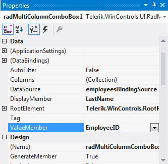

# Getting Started

The following tutorial demonstrates how to setup **RadMultiColumnComboBox** and retrieve the selected text and image.

1\. Add a **RadMultiColumnComboBox** and a **RadStatusStrip** to a **RadForm**.  
2\. By using the Visual Studio *Properties* grid and the *Data Source Configuration Wizard*, set the **DataSource**, **ValueMember** and **DisplayMember** properties of **RadMultiColumnComboBox**. Thus, **RadMultiColumnComboBox** will be bound to the Northwind.Employees table.



3\. Add a **RadImageButtonElement** and a **RadLabelElement** to the **RadStatusStrip**.
4\. In the Visual Studio *Properties* grid, select the **Events** tab and double click the **SelectedIndexChanged** event in order to generate an event handler.

{{source=..\SamplesCS\MultiColumnComboBox\MCCBgettingStarted.cs region=GettingStarted}} 
{{source=..\SamplesVB\MultiColumnComboBox\MCCBgettingStarted.vb region=GettingStarted}} 

````C#
private void radMultiColumnComboBox1_SelectedIndexChanged(object sender, EventArgs e)
{
    if (this.radMultiColumnComboBox1.SelectedIndex > -1)
    {
        Image img = GetImageFromBytes(this.radMultiColumnComboBox1.EditorControl.CurrentRow.Cells["Photo"].Value as byte[]);
        this.radImageButtonElement1.Image = img.GetThumbnailImage(32, 32, null, IntPtr.Zero);
        this.radLabelElement1.Text = this.radMultiColumnComboBox1.Text;
    }
}

private Image GetImageFromBytes(byte[] bytes)
{
    Image result = null;
    System.IO.MemoryStream stream = null;
    try
    {
        stream = new System.IO.MemoryStream(bytes, 78, bytes.Length - 78);
        result = Image.FromStream(stream);
    }
    catch
    {
        try
        {
            stream = new System.IO.MemoryStream(bytes, 0, bytes.Length);
            result = Image.FromStream(stream);
        }
        catch
        {
            result = null;
        }
    }
    finally
    {
        if (stream != null)
            stream.Close();
    }
    return result;
}

````
````VB.NET
Private Sub RadMultiColumnComboBox1_SelectedIndexChanged(sender As Object, e As EventArgs) Handles RadMultiColumnComboBox1.SelectedIndexChanged
    If Me.RadMultiColumnComboBox1.SelectedIndex > -1 Then
        Dim img As Image = GetImageFromBytes(TryCast(Me.RadMultiColumnComboBox1.EditorControl.CurrentRow.Cells("Photo").Value, Byte()))
        Me.RadImageButtonElement1.Image = img.GetThumbnailImage(32, 32, Nothing, IntPtr.Zero)
        Me.RadLabelElement1.Text = Me.RadMultiColumnComboBox1.Text
    End If
End Sub
 
Private Function GetImageFromBytes(bytes As Byte()) As Image
    Dim result As Image = Nothing
    Dim stream As System.IO.MemoryStream = Nothing
    Try
        stream = New System.IO.MemoryStream(bytes, 78, bytes.Length - 78)
        result = Image.FromStream(stream)
    Catch
        Try
            stream = New System.IO.MemoryStream(bytes, 0, bytes.Length)
            result = Image.FromStream(stream)
        Catch
            result = Nothing
        End Try
    Finally
        If stream IsNot Nothing Then
            stream.Close()
        End If
    End Try
    Return result
End Function

````

{{endregion}} 

5\. Open the **Property Builder** by using the **Smart Tag** and uncheck some of the columns in order to control which columns to be visible.
6\. Press `F5` to run the application and change the selection in **RadMultiColumnComboBox**.


# See Also

* [Design Time]()	
* [Data Binding]()	

 


