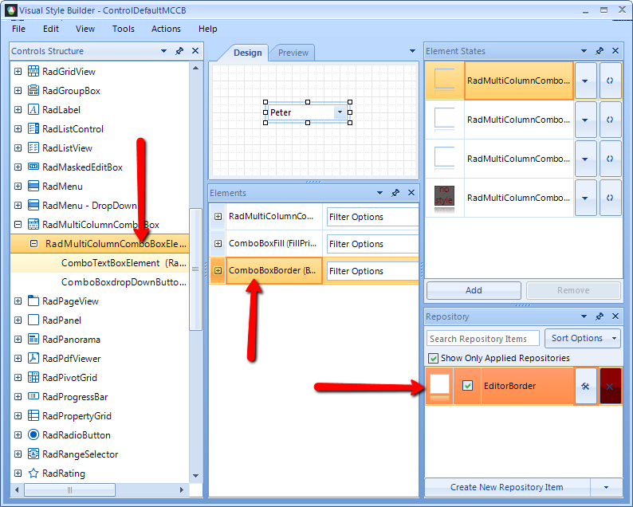
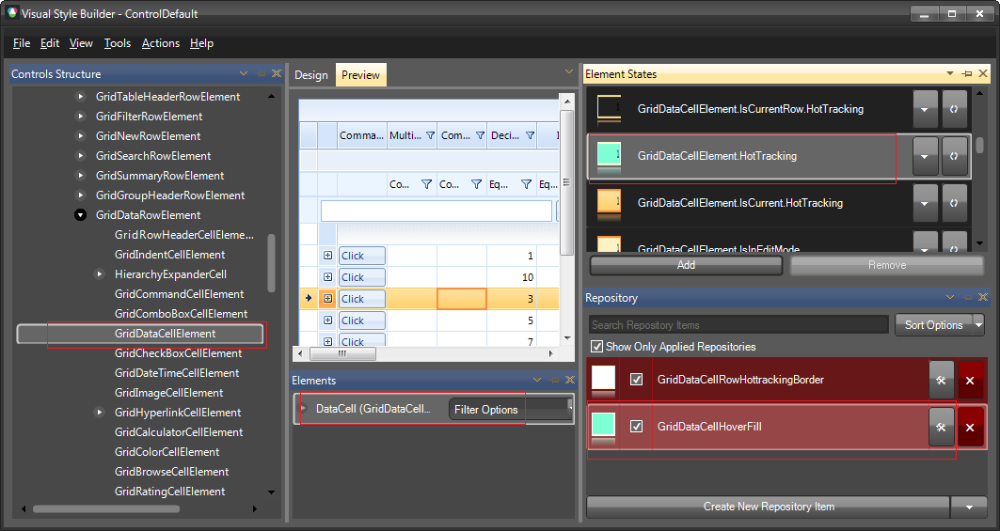
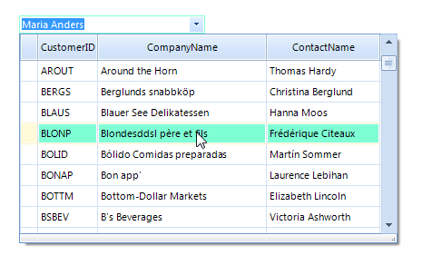

# Themes

## 

Since __RadMultiColumnComboBox__ is a compound control, it uses the theming of __RadGridView__. 
        Therefore, in order to make a theme for __RadMultiColumnComboBox__, you should change the styles for 
        __RadMultiColumnComboBox__ and for __RadGridView__. 
        The following example will show you how to edit the predefined __ControlDefault__ theme for the control.

1. Extract and open the __ControlDefault__ theme in __VisualStyleBuilder__.

1. First we can change the appearance of the __RadMultiColumnComboBox__ element. Let's change its 
            __BorderPrimitive ForeColor__ to *Light Green* 
            To do that we can just change the fore color of the already applied repository item style

1. Now we can edit the styles for the __RadGridView__. For this example we will change the selected row back color
            to a light green. This can be achieved by selecting the __GridDataCellElement__
            and changing the __BackColor__ of the __GridDataHoverCellHoverFill__ repository item.

1. Save the theme with some different name.

1. Load the Theme in your application. The result should look like in the below picture.

# See Also

 * [Load Predfined Themes]()

 * [Using Custom Themes]()
