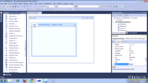

# PageView

## Overview
<table><th><tr><td>

RELATED VIDEOS</td><td></td></tr></th><tr><td>[Getting Started With RadPageView](http://tv.telerik.com/watch/winforms/getting-started-with-radpageview)

In this video, you will learn what it takes to get started with RadPageView. You will also learn about its different view modes.
              </td><td>

</td></tr></table>

RadPageView is yet another great addition to the Telerik UI for WinForms suite. As the name implies, this control layouts pages of subcontrols in different views. Here are some of the key RadPageView aspects:

* Extensibility, scalability and ease of use. With the new semantic that lies behind RadPageView,
              it is very easy to create custom views over a collection of pages.
            

* Well thought light element tree, which reduces both memory footprint and User Interaction response time and allows for easy and intuitive styling.
            

* Myriad of features in Strip View mode such as animated scrolling, item fit mode, item alignment, item size mode plus much more.
            

* Pixel-perfect look-and-feel.
            

* Polished and intuitive design-time support.
            

* Optional Header and Footer visual elements to emphasize on each item’s role in the application.
            

## RadPageView layout modes

RadPageView supports the following modes:

* Strip view mode:
            

* Stack view mode:
            

* Outlook view mode:
            

>The above three screens are made from one control, which __ViewMode__ property is altered accordingly.
          
