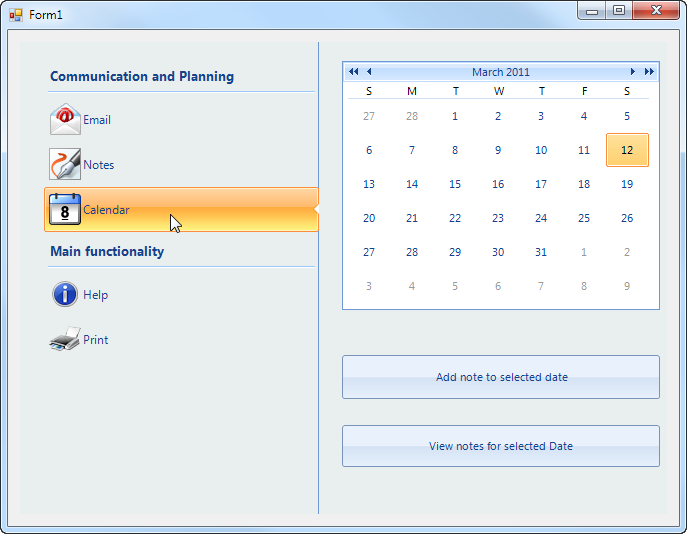

# Getting Started

## 

The Backstage view of RadPageView is designed as an answer to the introduced in Microsoft Office2010 view mode. This is an extended 
        	StripView mode, which means that all customizations that apply to strip view apply here as well. In this mode the items 
        	(RadPageViewPage items) are displayed on the left side (by default), but this can be easily customized. Orientation supports
        	all four modes and defines the relation between the content and the item area.  Additionally, you can add group header items.
       	

Follows a very simple example of how to use this mode:
       	

1. Drag RadPageView control from the Toolbox and by using the SmartTag drop down set the ViewMode to Backstage and add a few 
		  	groups and RadPageViewPages.

1. Select each page one by one and set their Text and Image properties accordingly.

1. Drag the desired controls from the Toolbox on each page content area.

1. Start the application and click on the Calendar page item.
