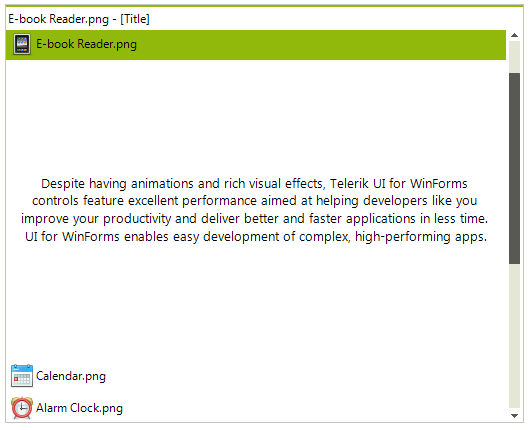

# ExplorerBarView

## 

The ExplorerBar mode of the RadPageView control is designed to handle multiple visible pages at once by implementing a scrolling mechanism, as well as extended keyboard navigation. This mode introduces three types of content sizing, as well as two types of stack position. The supported content size modes are as follows:

* FixedLength

* AutoSizeToBestFit

* EqualLength

* Top

* Left
 

