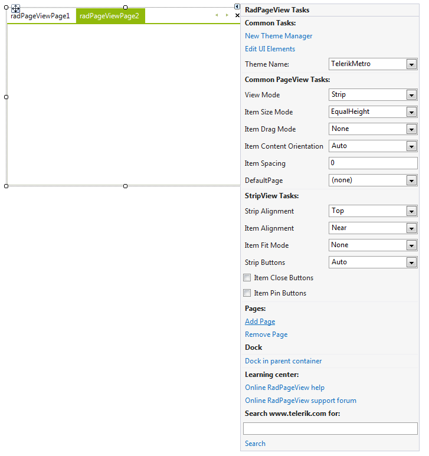

# Getting Started

To use **RadPageView**, you can simply drag it from Toolbox and drop it onto your form in the Visual Studio designer and use its [Smart Tag]() to add pages. To switch between the different view modes, you can set the **ViewMode** property in the *Properties* window of the control. 

>caption Figure 1: Adding pages via Smart Tag

To adjust properties of the specific view, you should find the __ViewElement__ property in the property grid and expand its sub-properties where you can find settings specific to the currently active view. This is the general approach to set up the **RadPageView** control in the designer without considering the view mode.

# See Also

* [Upgrading to RadPageView]()	
* [Design Time]()	
* [Architecture]()	