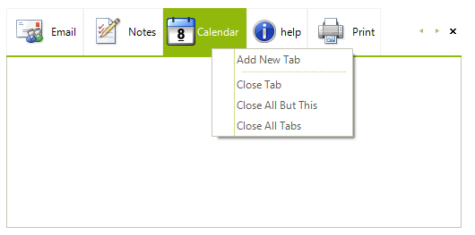

# Add ContextMenu to RadPageViewPage tabs

## 

This help article will demonstrate you how to add custom __RadContextMenu__ to __RadPageViewPages'__ tabs,
        as shown in the following image.

To create your custom __RadContextMenu__, add its' __RadMenuItems__, set their properties and add them
        to the __RadContextMenu__*Items* collection:

#### __[C#]__

{{region createContextMenu}}
	
	        private void CreateContextMenu()
	        {
	            RadMenuItem addNewTabMenuItem = new RadMenuItem();
	            addNewTabMenuItem.Text = "Add New Tab";
	            addNewTabMenuItem.Click += new EventHandler(addNewTabMenuItem_Click);
	            contextMenu.Items.Add(addNewTabMenuItem);
	            RadMenuSeparatorItem separator = new RadMenuSeparatorItem();
	            contextMenu.Items.Add(separator);
	            RadMenuItem closeTabMenuItem = new RadMenuItem();
	            closeTabMenuItem.Text = "Close Tab";
	            closeTabMenuItem.Click += new EventHandler(closeTabMenuItem_Click);
	            contextMenu.Items.Add(closeTabMenuItem);
	            RadMenuItem closeAllButThisMenuItem = new RadMenuItem();
	            closeAllButThisMenuItem.Text = "Close All But This";
	            closeAllButThisMenuItem.Click += new EventHandler(closeAllButThisMenuItem_Click);
	            contextMenu.Items.Add(closeAllButThisMenuItem);
	            RadMenuItem closeAllTabsMenuItem = new RadMenuItem();
	            closeAllTabsMenuItem.Text = "Close All Tabs";
	            closeAllTabsMenuItem.Click += new EventHandler(closeAllTabsMenuItem_Click);
	            contextMenu.Items.Add(closeAllTabsMenuItem);
	        }
	
	{{endregion}}

#### __[VB.NET]__

{{region createContextMenu}}
	
	    Private Sub CreateContextMenu()
	        Dim addNewTabMenuItem As New RadMenuItem()
	        addNewTabMenuItem.Text = "Add New Tab"
	        AddHandler addNewTabMenuItem.Click, AddressOf addNewTabMenuItem_Click
	        contextMenu1.Items.Add(addNewTabMenuItem)
	        Dim separator As New RadMenuSeparatorItem()
	        contextMenu1.Items.Add(separator)
	        Dim closeTabMenuItem As New RadMenuItem()
	        closeTabMenuItem.Text = "Close Tab"
	        AddHandler closeTabMenuItem.Click, AddressOf closeTabMenuItem_Click
	        contextMenu1.Items.Add(closeTabMenuItem)
	        Dim closeAllButThisMenuItem As New RadMenuItem()
	        closeAllButThisMenuItem.Text = "Close All But This"
	        AddHandler closeAllButThisMenuItem.Click, AddressOf closeAllButThisMenuItem_Click
	        contextMenu1.Items.Add(closeAllButThisMenuItem)
	        Dim closeAllTabsMenuItem As New RadMenuItem()
	        closeAllTabsMenuItem.Text = "Close All Tabs"
	        AddHandler closeAllTabsMenuItem.Click, AddressOf closeAllTabsMenuItem_Click
	        contextMenu1.Items.Add(closeAllTabsMenuItem)
	    End Sub
	
	    '#End Region
	
	    '#Region "eventHandlerImpl"
	
	    Private Sub addNewTabMenuItem_Click(ByVal sender As Object, ByVal e As EventArgs)
	        Dim newPage As New RadPageViewPage()
	        newPage.Text = "My new tab text"
	        radPageView1.Pages.Add(newPage)
	    End Sub
	
	    Private Sub closeTabMenuItem_Click(ByVal sender As Object, ByVal e As EventArgs)
	        radPageView1.Pages.Remove(radPageView1.SelectedPage)
	    End Sub
	
	    Private Sub closeAllButThisMenuItem_Click(ByVal sender As Object, ByVal e As EventArgs)
	        For i As Integer = radPageView1.Pages.Count - 1 To 0 Step -1
	            If radPageView1.Pages(i) IsNot radPageView1.SelectedPage Then
	                radPageView1.Pages.RemoveAt(i)
	            End If
	        Next i
	    End Sub
	
	    Private Sub closeAllTabsMenuItem_Click(ByVal sender As Object, ByVal e As EventArgs)
	        radPageView1.Pages.Clear()
	    End Sub
	
	    '#End Region
	
	    '#Region "mouseClick"
	
	    Private Sub radPageView1_MouseClick(ByVal sender As Object, ByVal e As MouseEventArgs)
	        Dim hitItem As RadPageViewItem = Me.radPageView1.ViewElement.ItemFromPoint(e.Location)
	        If e.Button = MouseButtons.Right AndAlso hitItem IsNot Nothing Then
	            contextMenu1.Show(Me.radPageView1.PointToScreen(e.Location))
	        End If
	    End Sub
	
	    '#End Region
	End Class

In the following code snippet you can observe, how to add the most common items functionalities:

#### __[C#]__

{{region eventHandlerImpl}}
	
	        void addNewTabMenuItem_Click(object sender, EventArgs e)
	        {
	            RadPageViewPage newPage = new RadPageViewPage();
	            newPage.Text = "My new tab text";
	            radPageView1.Pages.Add(newPage);
	        }
	
	        void closeTabMenuItem_Click(object sender, EventArgs e)
	        {
	            radPageView1.Pages.Remove(radPageView1.SelectedPage);
	        }
	
	        void closeAllButThisMenuItem_Click(object sender, EventArgs e)
			{
			    for (int i = radPageView1.Pages.Count - 1; i >= 0; i--)
			    {
			        if (radPageView1.Pages[i] != radPageView1.SelectedPage)
			        {
			            radPageView1.Pages.RemoveAt(i);
			        }
			    }
			}
	
	        void closeAllTabsMenuItem_Click(object sender, EventArgs e)
	        {
	            radPageView1.Pages.Clear();
	        }
	
	{{endregion}}

#### __[VB.NET]__

{{region eventHandlerImpl}}
	
	    Private Sub addNewTabMenuItem_Click(ByVal sender As Object, ByVal e As EventArgs)
	        Dim newPage As New RadPageViewPage()
	        newPage.Text = "My new tab text"
	        radPageView1.Pages.Add(newPage)
	    End Sub
	
	    Private Sub closeTabMenuItem_Click(ByVal sender As Object, ByVal e As EventArgs)
	        radPageView1.Pages.Remove(radPageView1.SelectedPage)
	    End Sub
	
	    Private Sub closeAllButThisMenuItem_Click(ByVal sender As Object, ByVal e As EventArgs)
	        For i As Integer = radPageView1.Pages.Count - 1 To 0 Step -1
	            If radPageView1.Pages(i) IsNot radPageView1.SelectedPage Then
	                radPageView1.Pages.RemoveAt(i)
	            End If
	        Next i
	    End Sub
	
	    Private Sub closeAllTabsMenuItem_Click(ByVal sender As Object, ByVal e As EventArgs)
	        radPageView1.Pages.Clear()
	    End Sub
	
	    '#End Region
	
	    '#Region "mouseClick"
	
	    Private Sub radPageView1_MouseClick(ByVal sender As Object, ByVal e As MouseEventArgs)
	        Dim hitItem As RadPageViewItem = Me.radPageView1.ViewElement.ItemFromPoint(e.Location)
	        If e.Button = MouseButtons.Right AndAlso hitItem IsNot Nothing Then
	            contextMenu1.Show(Me.radPageView1.PointToScreen(e.Location))
	        End If
	    End Sub
	
	    '#End Region
	End Class

After the context menu is created it have to be associated with __RadPageViewPages__ tabs. This can be done by subscribing to the __RadPageView__ instance' __MouseClick__ event:

#### __[C#]__

{{region mouseClick}}
	
	        void radPageView1_MouseClick(object sender, MouseEventArgs e)
	        {
	            RadPageViewItem hitItem = this.radPageView1.ViewElement.ItemFromPoint(e.Location);
	            if (e.Button == MouseButtons.Right && hitItem != null)
	            {
	                contextMenu.Show(this.radPageView1.PointToScreen(e.Location));
	            }
	        }
	
	{{endregion}}

#### __[VB.NET]__

{{region mouseClick}}
	
	    Private Sub radPageView1_MouseClick(ByVal sender As Object, ByVal e As MouseEventArgs)
	        Dim hitItem As RadPageViewItem = Me.radPageView1.ViewElement.ItemFromPoint(e.Location)
	        If e.Button = MouseButtons.Right AndAlso hitItem IsNot Nothing Then
	            contextMenu1.Show(Me.radPageView1.PointToScreen(e.Location))
	        End If
	    End Sub
	
	    '#End Region
	End Class

