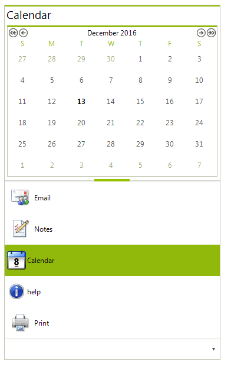
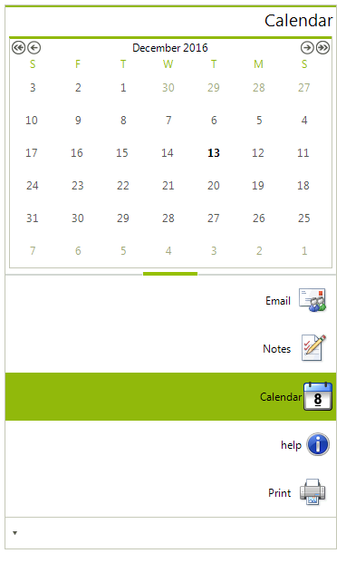

# Right-to-left support


## 

You can present the content of your pageview instance in a right-to-left direction by setting the __RightToLeft__ property to *Yes*: 
         #_[C#]_

	


{{source=..\SamplesCS\CommandBar\FloatingStrips.cs region=rtl}} 
{{source=..\SamplesVB\CommandBar\FloatingStrips.vb region=rtl}} 

````C#
            this.radCommandBar1.RightToLeft = RightToLeft.Yes;
````
````VB.NET
        Me.RadCommandBar1.RightToLeft = Windows.Forms.RightToLeft.Yes
        '
````

{{endregion}} 


Please note that this feature reorders the not only the system buttons, but it also changes
        the order of your custom items where necessary:

*RadPageView in StripView mode with RightToLeft = No*

*RadPageView in StripView mode with RightToLeft = Yes*

*RadPageView in OutlookView mode with RightToLeft = No*

*RadPageView in OutlookView mode with RightToLeft = Yes*

*RadPageView in StackView mode with RightToLeft = No*

*RadPageView in StackView mode with RightToLeft = Yes*
