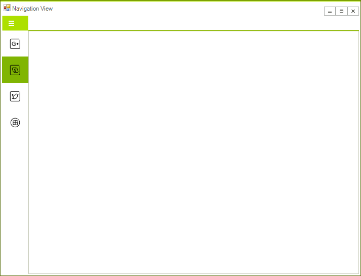
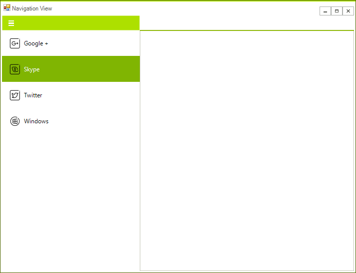

# Display Modes

The NavigationView supports four modes - *Auto*, *Minimal*, *Compact*, *Expanded*. This article describes all modes in details.

## Auto 

This mode switches between the other modes depending on the available free space. By default if the width is bellow 641 the *Minimal* mode is used. If the width is between  641 and 1008 the *Compact* mode is used. If there are more that 1008 pixels available the *Expanded* mode is used. 

## Minimal

With this mode the pages items are displayed in popup and you must click on the hamburger button in order to display them.

## Compact

This mode displays only the icons of the pages strips. The icons are always visible in this case. 

## Expanded

With this mode both the icons and the text of the items are displayed.

