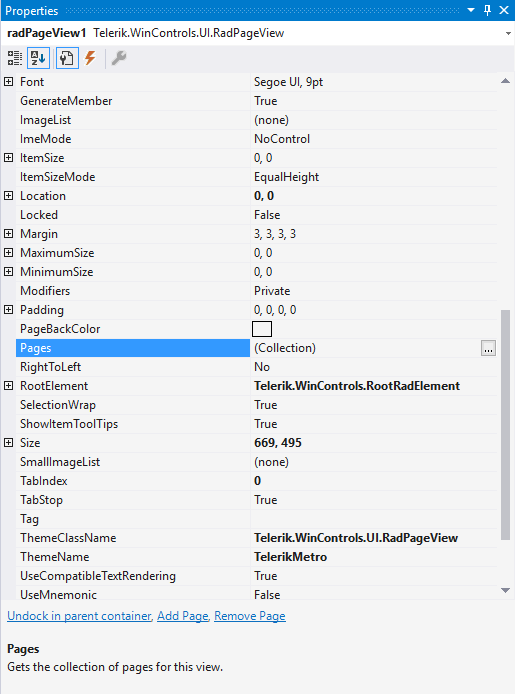
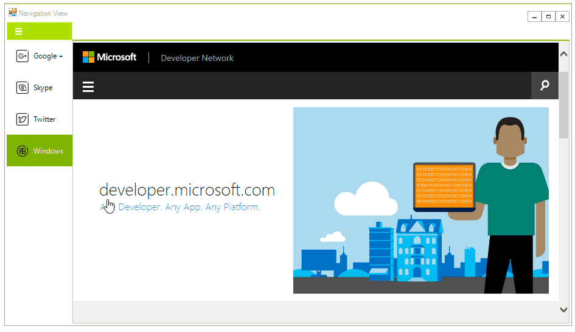

# Getting Started

In this tutorial you are going to create a simple RadPageView by using the __NavigationView__.

1. Create a new WinForms application using the standard template and drag RadPageView on your form. Dock it for Fill and add some pages by selection the pages collection in the Properties window.

    

2. Change the test and set an image to each page. The layout should look like this:

    
 
3. Once this is done you are ready to change the view. Open the smart tag and change the view to __NavigationView__. Change the __ViewMode__ to __Expanded__ as well. 

    

4.The final step concerns the process of adding some content in the content areas of the pages. To do so, again from the drop down list of the Visual Studio Property Window, select each of the created RadPageViewPages and drag the appropriate controls in the content area of the currently selected page.
    

# See Also

