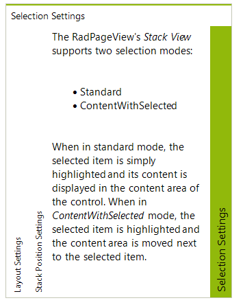

# Customizing the Selection Mode

## 

The Stack View supports three types of selection modes which define how the content area is positioned according to the selected item:

* Standard (default)

* ContentWithSelected

* ContentAfterSelected

The *Standard* selection mode is used by default and implies that the content area is positioned
        right next to the stack (according to the stack position as well) regardless of the currently selected item.

The *ContentWithSelected* selection mode implies that the content area is positioned
        with the selected item (before it in the stack direction).

*ContentAfterSelected**ContentWithSelected*

To set the selection mode you should use the *ItemSelectionMode* property of the RadPageViewStackElement
        as demonstrated in the code snippet below:#_[C#]_

	

#_[VB.NET]_

	

>note The ViewElement property of the RadPageView control returns a reference to the main element of the currently
          active view in the control. So, to cast the ViewElement to any an element representing a specific view type, you
          should make sure that you have set the ViewMode of the RadPageView control to this view type.
>

