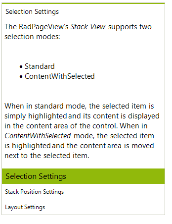
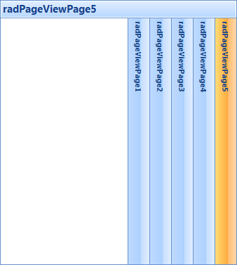

# StackView

## 

The Stack mode of the RadPageView control displays a stack of items whereby the content of the selected item is displayed above or next to the stack depending on the stack orientation. The Stack Mode supports four orientation and three selection types allowing for flexible customization possibilities. The orientation defines how the stack items are positioned in relation to the content area, whereas the selection mode defines how the content area is positioned according to the selected item, i.e. you can generally choose to display the content always next/on-top of the items’ stack, or next to the selected item. The screenshots below present some of the Stack View’s capabilities.

*Bottom stack* position and standard selection mode:

*Right stack*

*Bottom stack**ContentWithSelected*

