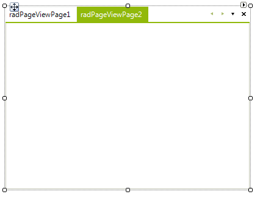
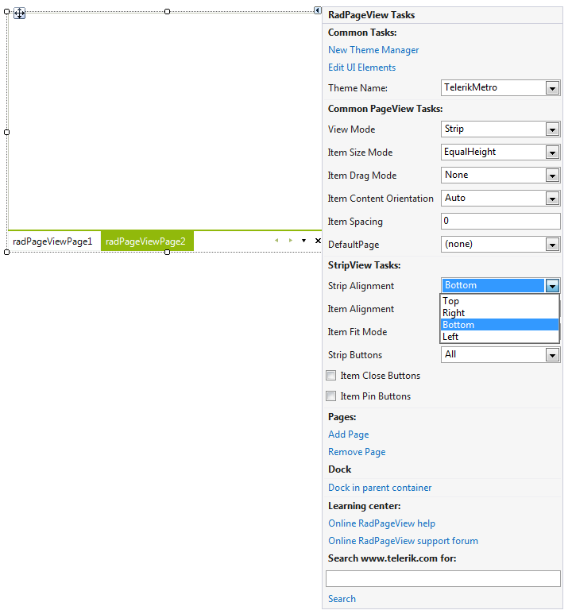

# Getting Started

## 

In this project we are going to create a simple RadPageView in Strip view mode.

In order to achieve this, you should follow these steps:

1. Create a new Windows Forms Application and drag RadPageView on your form.

1. Click the Smart Tag of RadPageView and then click the __Add Page__ link five times.This will create five RadPageViewPages:  

1. With the Action Menu opened, choose the *All* option from the __Strip Buttons__ drop-down list. This will add an overflow button to the default scroll and close buttons.  

1. Set the __Strip Alignment__ to *Bottom*. This will align the items to bottom in relation to the content area:  

1. Add five images to your project as resources.

1. From the drop-down list of the Visual Studio Property Window, select each of the created RadPageViewPages and set its __Image__ property to an image of your choice. You can set the __Text__ in the Property Window as well:  

1. The final step concerns the process of adding some content in the content areas of the pages. To do so, again from the drop-down list of the Visual Studio Property Window, select each of the created RadPageViewPages and drag the appropriate controls in the content area of the currently selected page:  
