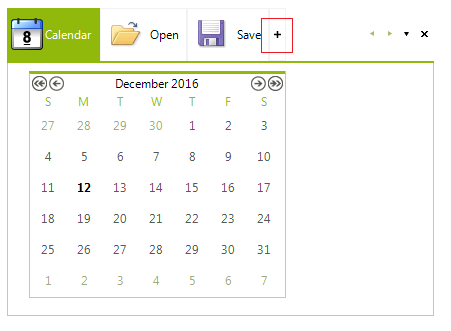
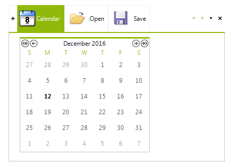
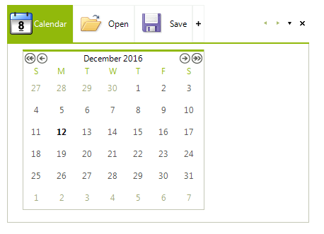
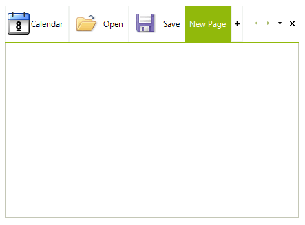

# New Item


RadPageView supports a special kind of page item that prompts the end-user to create a new page at runtime by clicking that item. Let's call the item "NewItem". When the NewItem is clicked, a special event is fired where the developer can decide what exactly should be done - in the context of RadPageView usually a new RadPageViewPage is being created.<br>

## Enabling the NewItem

You can easily show the NewItem by setting the __NewItemVisibility__ property of the RadPageViewStripElement. This property is of the enum type StripViewNewItemVisibility and has the following possible values:

* __Hidden__ (default value): The NewItem is hidden.

* __Front__: The NewItem appears in front of the other page items in the items strip area.<br>

* __End__: The NewItem appears at the end of the row of page items in the items strip area. <br>           
Here is how to set the NewItemVisibility property:

{{source=..\SamplesCS\PageView\NewItem.cs region=settingNewItemVisibility}} 
{{source=..\SamplesVB\PageView\NewItem.vb region=settingNewItemVisibility}} 

````C#
RadPageViewStripElement stripElement = this.radPageView1.ViewElement as RadPageViewStripElement;
stripElement.NewItemVisibility = StripViewNewItemVisibility.End;

````
````VB.NET
Dim stripElement As RadPageViewStripElement = TryCast(Me.RadPageView1.ViewElement, RadPageViewStripElement)
stripElement.NewItemVisibility = StripViewNewItemVisibility.End

````

{{endregion}} 

## Handling the clicked NewItem

When the NewItem is clicked by the end-user, RadPageView throws an event called __NewPageRequested__.  There you can create a new RadPageViewPage instance and add it to RadPageView. In the following code snippet we create a new RadPageViewPage, add it to RadPageView, select the newly created page, and make sure that the page item is fully visible by calling the EnsureItemVisible method.

{{source=..\SamplesCS\PageView\NewItem.cs region=newPageRequested}} 
{{source=..\SamplesVB\PageView\NewItem.vb region=newPageRequested}} 

````C#
void radPageView1_NewPageRequested(object sender, EventArgs e)
{
    RadPageView pageView = sender as RadPageView;
    RadPageViewStripElement stripElement = pageView.ViewElement as RadPageViewStripElement;
    RadPageViewPage page = new RadPageViewPage();
    page.Text = "New Page";
    pageView.Pages.Add(page);
    pageView.SelectedPage = page;
    pageView.ViewElement.EnsureItemVisible(stripElement.NewItem);
}

````
````VB.NET
Private Sub radPageView1_NewPageRequested(ByVal sender As Object, ByVal e As EventArgs)
    Dim pageView As RadPageView = TryCast(sender, RadPageView)
    Dim stripElement As RadPageViewStripElement = TryCast(pageView.ViewElement, RadPageViewStripElement)
    Dim page As New RadPageViewPage()
    page.Text = "New Page"
    pageView.Pages.Add(page)
    pageView.SelectedPage = page
    pageView.ViewElement.EnsureItemVisible(stripElement.NewItem)
End Sub

````

{{endregion}} 

The result is shown on the screenshot below:<br>
