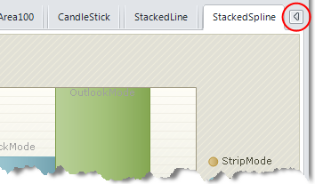
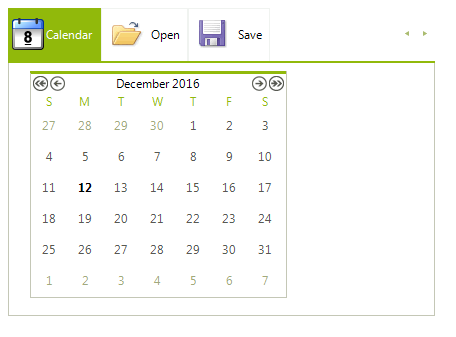
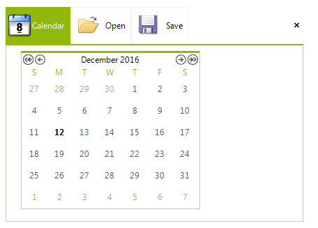
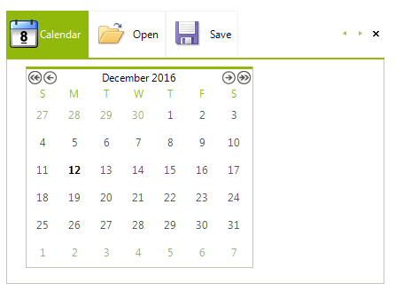
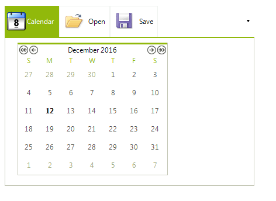
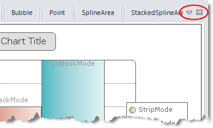
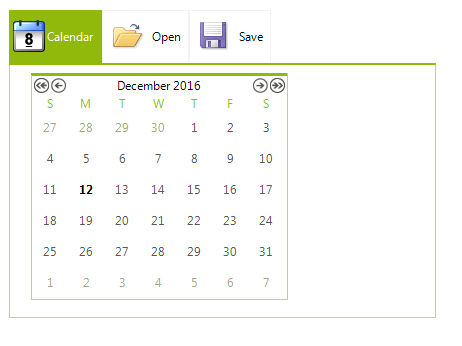

# Scrolling and Overflow (strip buttons)
 
The __StripButtons__ property of **RadPageView** in PageViewMode.*Strip* allows the user to scroll or get a drop down list of the tabs that overflow the available space. There is also a close button which, when pressed, closes the currently selected page. The __StripButtons__ property is available at **PadPageViewStripElement** which can be accessed through the __ViewElement__ property when **RadPageView** is in Strip mode, for example:

#### Accessing the StripButtons property

{{source=..\SamplesCS\PageView\StripView.cs region=scrollingAndOverflow}} 
{{source=..\SamplesVB\PageView\StripView.vb region=scrollingAndOverflow}} 

````C#
RadPageViewStripElement stripElement = (RadPageViewStripElement)this.radPageView1.ViewElement;
stripElement.StripButtons = StripViewButtons.All;

````
````VB.NET
Dim stripElement As RadPageViewStripElement = DirectCast(Me.radPageView1.ViewElement, RadPageViewStripElement)
stripElement.StripButtons = StripViewButtons.All

````

{{endregion}} 


PageViewMode.*Strip* supports the following __StripButtons__ modes:

* __All__. When this option is selected, **RadPageView** will display all the available strip buttons - *left scroll button, right scroll button, overflow button* and *close button:* 

>caption Figure 1: StripViewButtons.All

 

* __LeftScroll__. This option displays only the left scroll button:

>caption Figure 2: StripViewButtons.LeftScroll



* __RightScroll__. This option displays only the right scroll button:

>caption Figure 3: StripViewButtons.RightScroll


* __Scroll__. Display both left and right scroll buttons:

>caption Figure 4: StripViewButtons.Scroll



* __Close__. Displays only the close strip button.

>caption Figure 5: StripViewButtons.Close



* __VS2005Style__: Displays both scroll buttons and the close button: 

>caption Figure 6: StripViewButtons.VS2005Style



* __ItemList__. Displays a drop-down button that invokes a drop-down list of the items:

>caption Figure 7: StripViewButtons.ItemList



* __VS2008Style.__ Displays the item list drop-down button and the close button.

>caption Figure 8: StripViewButtons.VS2008Style



* __None__. Displays no strip buttons:

>caption Figure 9: StripViewButtons.None



# See Also

* [Fitting Items]()	
* [Strip Element Properties]()	
* [New Item]()	
