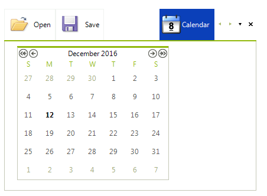

# Strip Element Properties

## 

You can use the following properties to change the behavior of the StripView

* __ShowItemCloseButton:__ Shows/hides the tabs close button.

* __ShowItemPinButton:__ Shows/hides the pin button. This button allows you to pin some of the tabs.

* __StripButtons:__ Controls which strip button are currently visible. Detailed information is available here: [Scrolling and Overflow (strip buttons)]()

* __ItemAlignment:__ Allows you to align the items.The possible values are: *Near, Center, Far*.

* __StripAlignment:__ Allows you to align the entire strip. The possible values are: *Bottom, Left, Top, Right*.    

* __PreviewItem:__ You can use this property to set the preview item. This item is opened for preview on the far side of the regular items. 

>important In order to be able to set the above properties you should cast the view element first:
>

#### Accessing the RadPageViewStripElement properties

{{source=..\SamplesCS\PageView\StripView.cs region=scrollingAndOverflow}} 
{{source=..\SamplesVB\PageView\StripView.vb region=scrollingAndOverflow}} 

````C#
RadPageViewStripElement stripElement = (RadPageViewStripElement)this.radPageView1.ViewElement;
stripElement.StripButtons = StripViewButtons.All;

````
````VB.NET
Dim stripElement As RadPageViewStripElement = DirectCast(Me.radPageView1.ViewElement, RadPageViewStripElement)
stripElement.StripButtons = StripViewButtons.All

````

{{endregion}}