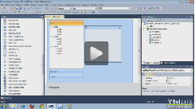

# Upgrading to RadPageView

| RELATED VIDEOS |  |
| ------ | ------ |
|[Converting from RadPanelBar to RadPageView](http://tv.telerik.com/watch/winforms/converting-from-radpanelbar-to-radpageview)In this video, you will learn how to convert a RadPanelBar to the new RadPageView control introduced in the Q2 2010 release of RadControls for WinForms.||
|[Converting from RadTabStrip to RadPageView](http://tv.telerik.com/watch/winforms/converting-from-radtabstrip-to-radpageview)In this video, you will learn how to convert a RadTabStrip to the new RadPageView control introduced in the Q2 2010 release of RadControls for WinForms.||

## 

>note This article is valid for Telerik UI for WinForms versions prior to Q2 2011 SP1 inclusive.
            The Upgrade Tool can be used only if started from the SmartTag of the obsolete controls. Since
            these controls have been removed in Q3 2011, their respective Upgrade Tools are not available as well.
            In case you want to use the tools, please upgrade/downgrade to Q2 2011 SP1 (v2011.2.11.831)
>

Since Q2 2010 several brand controls were released, as successors of older and
          not that optimized controls. These are:
        

* [RadPageView](http://www.telerik.com/help/winforms/pageview-overview.html)- successor of RadTabStrip and RadPanelBar.
            

* [RadListControl](http://www.telerik.com/help/winforms/dropdown-and-listcontrol-listcontrol-overview.html) - successor of RadListBox.
            

* [RadDropDownList](http://www.telerik.com/help/winforms/dropdown-and-listcontrol-dropdownlist-overview.html) - successor of RadComboBox.
            

In order to encourage our users to use the new controls, we have removed all the old controls
          from our Toolbox. But what about old controls, present in already existing applications?
          A manual conversion by simply dropping the new control and moving the entire content of the
          old control to the new one is not a straightforward process. Here comes the new tool,
          introduced in our Q2 2010 Service Pack 1 release, namely Telerik Conversion Wizard.
          The tool is available as a smart tag option in all Telerik Controls:
        

*The “Conversion Wizard…” command will open the wizard dialog. *

*
            On the left side are listed all the controls, available for conversion, while on
            the right side are all the controls that will be actually converted. The two lists can be
            organized using the buttons in the middle.
          *

Upon loading the tool will loop through all the components registered with the
          current design surface and will populate the ones that may be converted to newer controls.
          All the controls that will be converted should be put in the right list and the “Convert” button
          should be clicked.
        

>note RadPageView does not support adding elements directly to a RadPageViewPage. Hence a
            conversion from RadPanelBar will create empty pages for element-based groups; only groups
            that are used as control hosts will be completely converted. Old controls will be DELETED
            upon conversion, so make sure that you have backed-up your projects first.
>

>note Events are not converted. When you convert an obsolete control, your event handler methods will remain intact, but it
            is important to note that the event subscriptions will be cleared.
>

