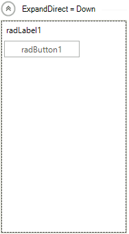
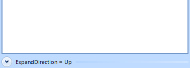
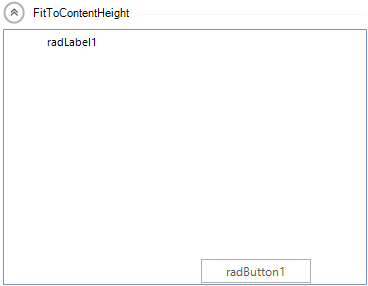

# Methods and properties

Below you will find the methods properties and events of __RadCollapsiblePanel__

## Properties

__ExpandDirection__ - Indicates the direction of the expand animation. The collapse animation is in the opposite direction.

{{source=..\SamplesCS\PanelsAndLabels\CollapsiblePanel\CollapsiblePanelGettingStarted.cs region=ExpandDirections1}} 
{{source=..\SamplesVB\PanelsAndLabels\CollapsiblePanel\CollapsiblePanelGettingStarted.vb region=ExpandDirections1}} 

````C#
this.radCollapsiblePanel1.ExpandDirection = RadDirection.Down;

````
````VB.NET
Me.RadCollapsiblePanel1.ExpandDirection = RadDirection.Down

````

{{endregion}} 




{{source=..\SamplesCS\PanelsAndLabels\CollapsiblePanel\CollapsiblePanelGettingStarted.cs region=ExpandDirections2}} 
{{source=..\SamplesVB\PanelsAndLabels\CollapsiblePanel\CollapsiblePanelGettingStarted.vb region=ExpandDirections2}} 

````C#
this.radCollapsiblePanel1.ExpandDirection = RadDirection.Left;

````
````VB.NET
Me.RadCollapsiblePanel1.ExpandDirection = RadDirection.Left

````

{{endregion}} 


{{source=..\SamplesCS\PanelsAndLabels\CollapsiblePanel\CollapsiblePanelGettingStarted.cs region=ExpandDirections3}} 
{{source=..\SamplesVB\PanelsAndLabels\CollapsiblePanel\CollapsiblePanelGettingStarted.vb region=ExpandDirections3}} 

````C#
this.radCollapsiblePanel1.ExpandDirection = RadDirection.Right;

````
````VB.NET
Me.RadCollapsiblePanel1.ExpandDirection = RadDirection.Right

````

{{endregion}} 


{{source=..\SamplesCS\PanelsAndLabels\CollapsiblePanel\CollapsiblePanelGettingStarted.cs region=ExpandDirections4}} 
{{source=..\SamplesVB\PanelsAndLabels\CollapsiblePanel\CollapsiblePanelGettingStarted.vb region=ExpandDirections4}} 

````C#
this.radCollapsiblePanel1.ExpandDirection = RadDirection.Up;

````
````VB.NET
Me.RadCollapsiblePanel1.ExpandDirection = RadDirection.Up

````

{{endregion}} 




__EnableAnimation__ - Indicates whether to use animation to expand or collapse the control.

{{source=..\SamplesCS\PanelsAndLabels\CollapsiblePanel\CollapsiblePanelGettingStarted.cs region=EnableAnimation}} 
{{source=..\SamplesVB\PanelsAndLabels\CollapsiblePanel\CollapsiblePanelGettingStarted.vb region=EnableAnimation}} 

````C#
this.radCollapsiblePanel1.EnableAnimation = false;

````
````VB.NET
Me.RadCollapsiblePanel1.EnableAnimation = False

````

{{endregion}}

__ContentSizingMode__ -  Indicates whether the controls container will resize to fit the width or the height of its content.

{{source=..\SamplesCS\PanelsAndLabels\CollapsiblePanel\CollapsiblePanelGettingStarted.cs region=ContentSizingMode1}} 
{{source=..\SamplesVB\PanelsAndLabels\CollapsiblePanel\CollapsiblePanelGettingStarted.vb region=ContentSizingMode1}} 

````C#
this.radCollapsiblePanel1.ContentSizingMode = CollapsiblePanelContentSizingMode.FitToContentWidth;

````
````VB.NET
Me.RadCollapsiblePanel1.ContentSizingMode = CollapsiblePanelContentSizingMode.FitToContentWidth

````

{{endregion}} 


{{source=..\SamplesCS\PanelsAndLabels\CollapsiblePanel\CollapsiblePanelGettingStarted.cs region=ContentSizingMode2}} 
{{source=..\SamplesVB\PanelsAndLabels\CollapsiblePanel\CollapsiblePanelGettingStarted.vb region=ContentSizingMode2}} 

````C#
this.radCollapsiblePanel1.ContentSizingMode = CollapsiblePanelContentSizingMode.FitToContentHeight;

````
````VB.NET
Me.RadCollapsiblePanel1.ContentSizingMode = CollapsiblePanelContentSizingMode.FitToContentHeight

````

{{endregion}} 



{{source=..\SamplesCS\PanelsAndLabels\CollapsiblePanel\CollapsiblePanelGettingStarted.cs region=ContentSizingMode3}} 
{{source=..\SamplesVB\PanelsAndLabels\CollapsiblePanel\CollapsiblePanelGettingStarted.vb region=ContentSizingMode3}} 

````C#
this.radCollapsiblePanel1.ContentSizingMode = CollapsiblePanelContentSizingMode.FitToContentWidth | CollapsiblePanelContentSizingMode.FitToContentHeight;

````
````VB.NET
Me.RadCollapsiblePanel1.ContentSizingMode = CollapsiblePanelContentSizingMode.FitToContentWidth Or CollapsiblePanelContentSizingMode.FitToContentHeight

````

{{endregion}} 


__ShowHeaderLine__ - If *true*, a line will be displayed in the header which will fill the available space, otherwise it will not be displayed.<br>

__HorizontalHeaderAlignment__ -Determines how the elements in the header to be aligned when it is in a horizontal position:

* Center

* Right

* Left

* Stretch

__VerticalHeaderAlignment__ - Determines how the elements in the header to be aligned when it is in a vertical position:

* Center

* Bottom

* Top

* Stretch

__AnimationType__ - Determines the type of the animation when expanding or collapsing the control:

* Reveal


* Slide


