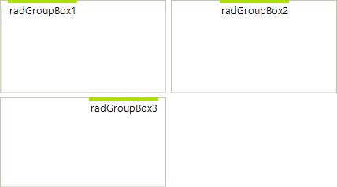
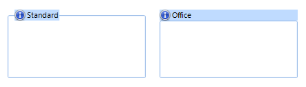
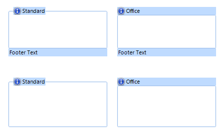

# Header Styling Options

##  HeaderPosition

The HeaderPosition can be set to *Top*, *Right*, *Bottom*, and *Left*: 

## HeaderAlignment

HeaderAlignment takes *Near*, *Center*, and *Far *values: 

>note HeaderAlignment is not taken into consideration when the GroupBoxStyle is set to Office. In this case the header occupies the whole width or height of the control. You may use HeaderTextAlignment and HeaderImageAlignment properties in this case.
>

## GroupBoxStyle

There are two styles - *Standard *and *Office*: 

## FooterVisibility 

Footer can be *Visible, Collapsed, and Hidden:* 

Note: The default value is *Collapsed*.

## Images in the header and footer

The text and image relation can be set with the familiar properties: *HeaderImageAndTextRelation*, *HeaderImageAlignment*, and *HeaderTextAlignment*: 

There are corresponding footer properties.

## Other properties 

Please refer to the [TPF structure]() topic in the Advanced section of the documentation.
