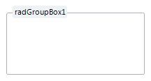
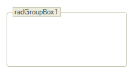
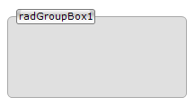

# Themes

The following theme components are provided for the *RadGroupBox*.
      Please refer to the themes section of the documentation about general information on using themes.

## ControlDefault

## Office2007Black

## Office2010Silver

## Desert

## Telerik

## Aqua

## Breeze
