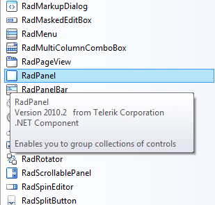

# Creating a RadPanel with Gradient Background

## 

You can easily add a gradient background to a RadPanel control by modifying the *FillPrimitive*  which is part of the element hierarchy that builds the visual appearance of this control.

Please, follow the steps below to add a gradient background to a RadPanel control:

1. Create a new RadForm control and drop a RadPanel onto the form from the Visual Studio Toolbox: 

1. Select the RadPanel and execute the Edit UI Elements action from its Smart Tag: 

1. A dialog form will show up. In the Tree View on the right the element hierarchy of the control is populated. Find and select the FillPrimitive node and take a look at the Property Grid on the right: 

1. To set up a gradient, you should first set the *GradientStyle* of the *FillPrimitive* to *Linear*. After that you should define the count of the colors which will be blended to build the gradient. The *FillPrimitive *supports up to 4 colors. You can use the *BackColor, BackColor1, BackColor2, BackColor3* properties to define the colors for the gradient: The *GradientPercentage* and *GradientPercentage2* properties define the position of the stops between the colors which are blended. You can use these properties to fine tune the appearance of your gradient: 