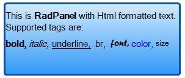

# Panel

RadPanel provides the features of a standard panel but adds advanced styling and text: 

The screenshot above demonstrates the use of a border, border width, background with a linear gradient, and Html-like formatted text. 

>note Please refer to Html-like formatting for further details about it.
>

## Themes

Please refer to the themes section in the documentation about further details.

*Edit UI Elements* dialog You can start the *Edit UI Elements* dialog by clicking on the link in the *smart tag*: 

Changes are serialized in the Designer.cs file of your form. Furthermore, changes in *Edit UI Elements* dialog have higher precedence over the theme settings.
