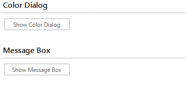

# Separator

## 

RadSeparator is a control that gives you the ability to divide your forms into logical parts. By default it contains of two lines.<br>

The control have several properties that you might find interesting:

* __Orientation__ - gets or sets the control orientation to Vertical or Horizontal<br>

* __ShadowOffset__ - gets or sets the offset of the both lines, both horizontal and vertical

* __ShowShadow__ - enables/disables the second line

* __SeparatorElement__ - the element that holds the lines. Gives you the ability to access and customize them

Follows a small sample, which demonstrates how to take advantage of the functionalities of RadSeparator

#### Customize RadSeparator

{{source=..\SamplesCS\PanelsAndLabels\Separator\Separator.cs region=separatorExample}} 
{{source=..\SamplesVB\PanelsAndLabels\Separator\Separator.vb region=separatorExample}} 

````C#
radSeparator1.ShadowOffset = new Point(10, 0);
radSeparator1.SeparatorElement.Line1.LineWidth = 5;
radSeparator1.SeparatorElement.Line2.LineWidth = 5;
radSeparator1.ShowShadow = true;
radSeparator1.Orientation = Orientation.Horizontal;
radSeparator1.SeparatorElement.Line1.BackColor = Color.Yellow;
radSeparator1.SeparatorElement.Line1.BackColor2 = Color.Orange;
radSeparator1.SeparatorElement.Line1.BackColor3 = Color.Red;
radSeparator1.SeparatorElement.Line1.NumberOfColors = 3;
radSeparator1.SeparatorElement.Line1.GradientStyle = Telerik.WinControls.GradientStyles.Linear;
radSeparator1.SeparatorElement.Line1.GradientAngle = 0;
radSeparator1.SeparatorElement.Line2.BackColor = Color.Black;
radSeparator1.SeparatorElement.Line2.BackColor2 = Color.Green;
radSeparator1.SeparatorElement.Line2.BackColor3 = Color.LightGreen;
radSeparator1.SeparatorElement.Line2.NumberOfColors = 3;
radSeparator1.SeparatorElement.Line2.GradientStyle = Telerik.WinControls.GradientStyles.Linear;
radSeparator1.SeparatorElement.Line2.GradientAngle = 0;

````
````VB.NET
RadSeparator1.ShadowOffset = New Point(10, 0)
RadSeparator1.SeparatorElement.Line1.LineWidth = 5
RadSeparator1.SeparatorElement.Line2.LineWidth = 5
RadSeparator1.ShowShadow = True
RadSeparator1.Orientation = Orientation.Horizontal
RadSeparator1.SeparatorElement.Line1.BackColor = Color.Yellow
RadSeparator1.SeparatorElement.Line1.BackColor2 = Color.Orange
RadSeparator1.SeparatorElement.Line1.BackColor3 = Color.Red
RadSeparator1.SeparatorElement.Line1.NumberOfColors = 3
RadSeparator1.SeparatorElement.Line1.GradientStyle = Telerik.WinControls.GradientStyles.Linear
RadSeparator1.SeparatorElement.Line1.GradientAngle = 0
RadSeparator1.SeparatorElement.Line2.BackColor = Color.Black
RadSeparator1.SeparatorElement.Line2.BackColor2 = Color.Green
RadSeparator1.SeparatorElement.Line2.BackColor3 = Color.LightGreen
RadSeparator1.SeparatorElement.Line2.NumberOfColors = 3
RadSeparator1.SeparatorElement.Line2.GradientStyle = Telerik.WinControls.GradientStyles.Linear
RadSeparator1.SeparatorElement.Line2.GradientAngle = 0

````

{{endregion}} 

Here is the result of the following code:<br>
