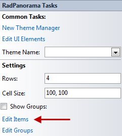
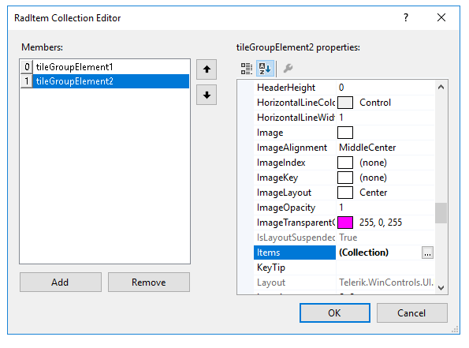
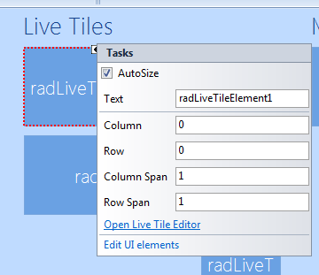

# Design Time

RadPanorama supports adding and customizing tiles and groups at design time. All customizations are introduced by the Smart Tag menu of the specified item.

The items available in the control Smart Tag are:

* New Theme Manager – add new RadThemeManager component

* Edit UI Elements – allows you to modify the control elements and their properties

* Theme Name – allows you to set the theme for the control

* Rows – define the number of rows that the control will have

* Cell Size – define the size of each cell 

* Show Groups – shows the groups in the control (if any)

* Edit Items – opens an editor, which allows you to add RadTileElements and RadLiveTileElements 

* Edit Groups – opens editor, which allows you to add groups to the control

## Adding Tiles

In order to add or remove tiles either click on the “*Edit items*” link in the smart tag menu or edit the __Items__ collection in the Properties window in Visual Studio. You can add two types of elements to the __Items__ collection: __RadTileElement__ and __RadLiveTileElement__. 

## Adding Groups

To add or remove groups click on the “*Edit Groups*” link in the smart tag menu or edit the __Groups__ collection in the Properties window in Visual Studio. To add tiles to a group, edit the __Items__ collection of the group itself. Switching between grouped or ungrouped view, is achieved by checking or unchecking the *ShowGroups* checkbox in the smart tag menu or setting the __ShowGroups__ property in the Properties window in Visual Studio. 

## Customizing tiles

Each __RadTileElement__ properties can be customized via the properties window of Visual Studio, or via the Smart Tag menu. The available properties for customization in the Smart Tag menu are:

* Text – sets the text of the tile

* Column – define in which column the item resides in

* Row – define in which row the item resides in

* Column Span – define the item lenght by specifying how many columns it should take

* Row Span – define the item height by specifying how many rows it should take

* Edit UI elements – allows you to edit the element’s properties  

## Customizing Live Tiles

Each __RadLiveTileElement__ properties can be customized via the properties window of Visual Studio, or via the Smart Tag menu. The available properties for customization in the Smart Tag menu are:

* Text – sets the text of the tile

* Column – define in which column the item resides in

* Row – define in which row the item resides in

* Column Span – define the item lenght by specifying how many columns it should take

* Row Span – define the item height by specifying how many rows it should take

* Open Live Tile Editor – opens the [Live Tile Editor](), where you can customize the tile.

* Edit UI elements – allows you to edit the element’s properties  
