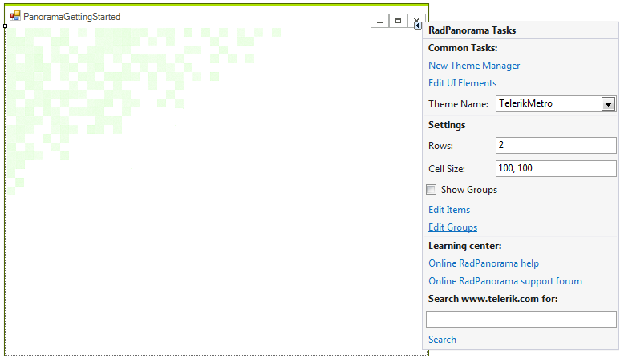
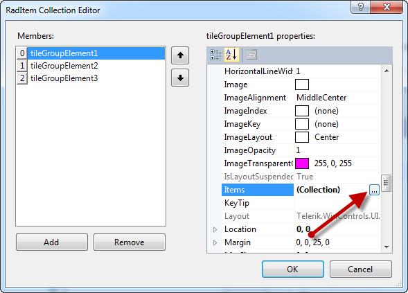
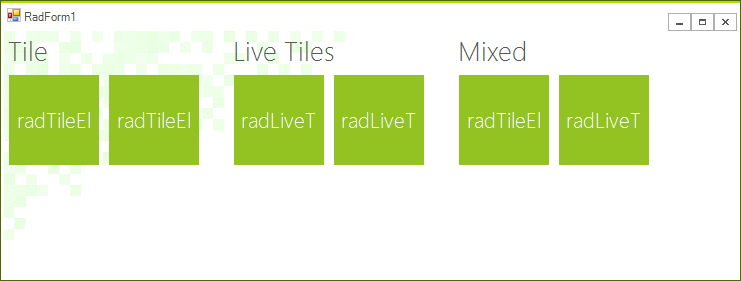
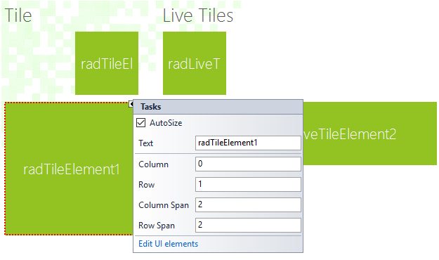

# Getting Started

| RELATED VIDEOS |  |
| ------ | ------ |
|[Getting started with RadPanorama ](http://tv.telerik.com/watch/winforms/getting-started-with-radpanorama)|In this video, we are going to see what it takes to get started with the RadPanorama. 
		              RadPanorama is a control that displays elements of type RadTileElement in a mosaic manner. 
		              This control is inspired by the Metro Start Menu screen of Windows 8.|

This article will demonstrate how to get started with RadPanorama control.
      	You will be guided through the process of creating a sample application step-by-step.
      

## 

1. Let’s start by adding RadPanorama control to the form and setting its __Dock__ 
	  		property to *Fill* in the properties window.
	  	

1. Click the RadPanorama control and the *Smart Tag* will appear in 
	  		the upper right corner. Click the *Smart Tag* and the menu will popup.
	  	

1. In the *Smart Tag* menu click the __Edit Groups__ link:
	  	

1. RadItemCollection editor will be opened. Add three groups and set their __Text__ 
	  		properties to: *Tile, Live Tiles, Mixed*

1. Now, navigate to the __Items__ property of each group and add few items in it.
	  		In this case the first group will contain only __RadTileElements__, the 
	  		second group only __RadListTileElements__ and the third group both types
	  		of elements.
	  	

1. Then click OK to close the editor.
	  	

1. Go back to the *Smart Tag* menu and check the __Show Groups__ check box.
	  	

1. Select each tile and in each tile’s *Smart Tag*, edit its __Column__,
	  		__Row__, __Column Span__ and __Row Span__ properties. 
	  	

1. Once you are done with the customization of the properties, if the size that the items 
	  		need is greater than the control size, the scroll bar will automatically be shown:
	  	

1. The layout is done. You can customize each item according to your needs and also you can subscribe
	  		to the __Click__ event of each of them, in order to perform some action upon click.
	  		To customize RadLiveTileElements, you can use the 
	  		[Live Tile Editor]()
