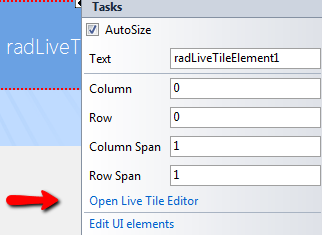
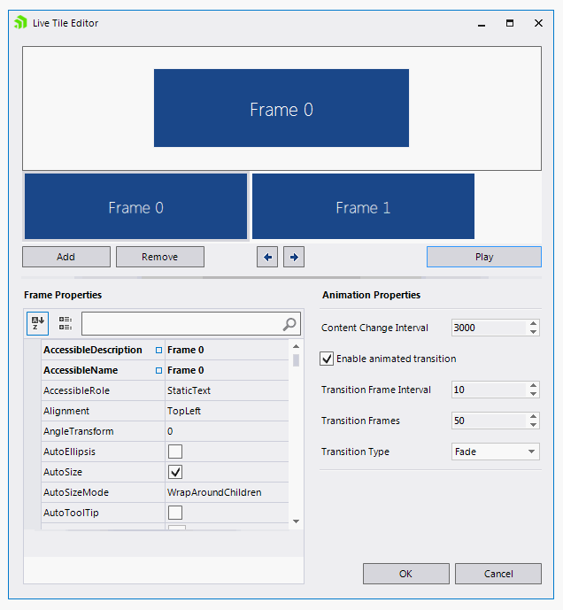
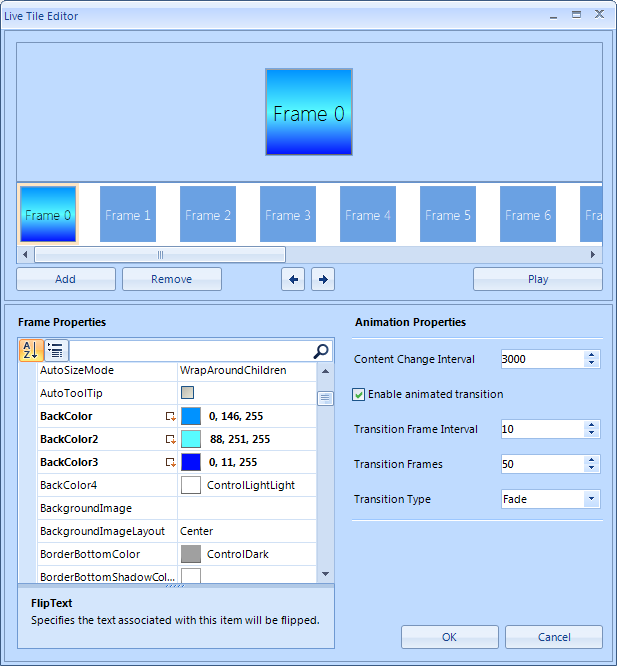

# Live Tile Editor

The **Live Tile Editor** allows you to easily create, edit and preview the contents of **RadLiveTileElement**. To open the **Live Tile Editor**, use the “*Open Live Tile Editor*” link in the **Smart Tag** of a live tile. 

The **Live Tile Editor** consists of several controls. At the top there is a preview panel in which you can see the changes you make to a frame or watch the whole animation by pressing the `Play` button.  

     

Just below the preview panel, there is a list of all frames that are contained within the live tile. Selecting a frame from that list loads its properties in the property grid on the left and displays a preview of the frame in the preview panel.

There are several buttons in the **Live Tile Editor** which execute different commands:

* `Add` button - adds a frame to the **RadLiveTileElement**.

* `Remove` button - removes a frame from the **RadLiveTileElement**.

* Arrow buttons - select the previous/next frame.

* `Play` button - starts playing the animation in the preview panel.

As mentioned above, the property grid on the left is used to edit the properties of the selected frame. On the right, there are some more editors which allow you to edit the properties of the transition animation.

* **Content Change Interval** - sets the interval between each frame change.

* **Enable Transition Animation** – enables or disables animated frame change.

* **Transition Frame Interval** - sets the animation interval in the transition animation. Greater values will slow down the animation, lesser values will speed it up.

* **Transition Frames** - sets the number of steps in the transition animation.

* **Transition Type** - sets the type of the transition animation. 

# See Also

* [Structure]()	
* [Design Time]()	
* [Getting Started]()	
