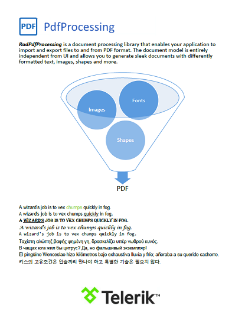

# PdfProcessing

## 

__RadPdfProcessing__ is a processing library that allows to create, import and export PDF documents. 

Some of the features you can take advantage of are:

* Import/export to PDF format.

* Support for images and shapes.

* Easy-to-use API for document generation.
            
