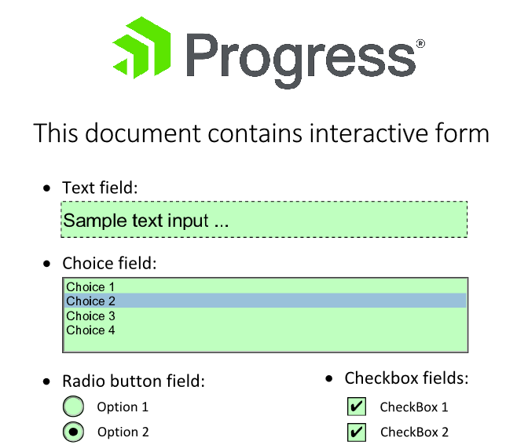

# Interactive Forms

With RadPdfViewer, you can provide the end users the ability to show, fill and save documents containing interactive forms (available from R3 2017). 

The control renders each field according to its type and provides an easy way for the user to edit its value. **Figure 1** shows a document containing text, choice, radio button and check box fields.

>caption Figure 1: Interactive form fields in RadPdfViewer

>tip In the versions between R1 and R3 2017, the content of the interactive forms is visualized read-only. The interactions with the form fields are supported since R3 2017. 

## Working with Interactive Forms in Code-Behind

The form fields in a document are preserved in its **AcroForm** property. You can obtain a form field value through the **FormFields** collection of the **AcroForm**.

>tip The UI of RadPdfViewer responds to interactive changes in field values (through mouse interaction with the UI) and it is not recommended to change the field collection in code. If you change the field values from your code, this may lead to unpredictable UI behavior and the applied changes will not be saved when using the **SaveAs** command.

After filling the forms, you can save the document using the Save As command.  

## See Also

* [Digital Signature]()
