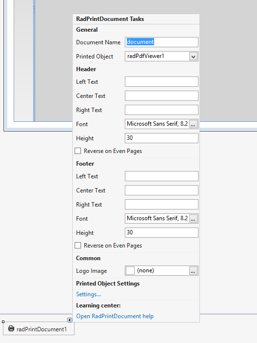

# Printing support

RadPdfViewer can be used with [RadPrintDocument]() just as any other control that supports printing – drag a __RadPrintDocument__ to the form and set the __Printed Object__ to the desired viewer. <br>

As such, RadPdfViewer allows you to benefit from the features that RadPrintDocument provides: header, footer, watermark, preview and settings dialogs.

## Using UI

__RadPdfViewerNavigator__ allows you to print the currently shown PDF document with a simple button click which opens the *Print Preview* dialog.


## Printing with code

RadPdfViewer also exposes the two known methods which allow you to easily print the document without involving any complicated settings:

{{source=..\SamplesCS\PdfViewer\PdfGettingStarted.cs region=PrintMethods}} 
{{source=..\SamplesVB\PdfViewer\PdfGettingStarted.vb region=PrintMethods}} 

````C#
this.radPdfViewer1.Print();
this.radPdfViewer1.PrintPreview();

````
````VB.NET
Me.RadPdfViewer1.Print()
Me.RadPdfViewer1.PrintPreview()

````

{{endregion}}