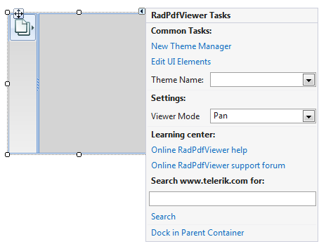
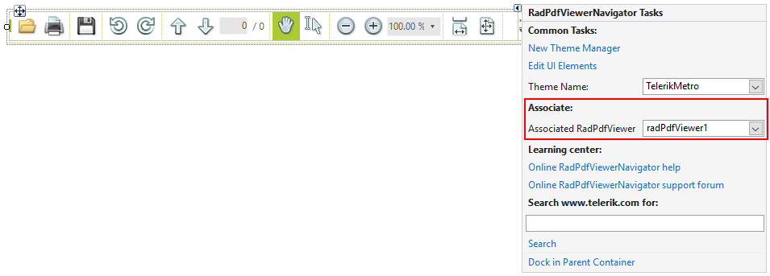

# Getting started

<table><th><tr><td>

RELATED VIDEOS</td><td></td></tr></th><tr><td>

[Getting Started with the WinForms RadPdfViewer](http://tv.telerik.com/watch/radcontrols-for-winforms/getting-started-with-the-winforms-radpdfviewer)

RadPdfViewer enables you to easily load and display PDF documents natively in your app without
              using any third-party tools except Telerik’s WinForms toolbox. Thanks to its built-in UI virtualization,
              RadPdfViewer delivers a performant solution in every scenario. This component will come as a nice addition
              to your Content Management Systems and Reporting applications, let’s see what RadPdfViewer provides as a feature set.
            </td><td></td></tr></table>

## 

This article will help you quickly get started with RadPdfViewer. To start off, drag and drop a RadPdfViewer control from the toolbox to your form.
          Open its smart tag menu and you will find two important settings: __ReadingMode__ and __ViewerMode__.
        

The __ReadingMode__ defines how the contents a document will be read. AllAtOnce means that all the content will be loaded initially. 
          As a result the initial loading time might be increased but the initial render time of a page will be shorter. __OnDemand__ means 
          that the contents of the page will be loaded when it initially comes into view. This will result in fast initial loading of the document but slower 
          initial page rendering. Also, the initial memory footprint will be less.
        

The __ViewerMode__ specifies the behavior of RadPdfViewer when you left-click in the document and drag across the document.
          There are three viewer modes:
        

* *None* - the control does nothing
            

* *Pan* - the document is scrolled in the respective direction
            

* *TextSelection* - selection is initiated, which stops when you release the button of the mouse
            

There are also properties for the above settings which you can set in your code:

#### __[C#] __

{{source=..\SamplesCS\PdfViewer\PdfGettingStarted.cs region=Modes}}
	
	            this.radPdfViewer1.ReadingMode = ReadingMode.OnDemand;
	            this.radPdfViewer1.ViewerMode = FixedDocumentViewerMode.TextSelection;
	
	{{endregion}}

#### __[VB.NET] __

{{source=..\SamplesVB\PdfViewer\PdfGettingStarted.vb region=Modes}}
	
	        Me.RadPdfViewer1.ReadingMode = ReadingMode.OnDemand
	        Me.RadPdfViewer1.ViewerMode = FixedDocumentViewerMode.TextSelection
	
	        '#End Region
	
	        '#Region "Loading"
	
	        Me.RadPdfViewer1.LoadDocument(Application.StartupPath & "\PdfViewer\Sample.pdf")
	
	        '#End Region
	
	        '#Region "Navigator"
	
	        Me.RadPdfViewerNavigator1.AssociatedViewer = Me.RadPdfViewer1
	
	        '#End Region
	    End Sub
	
	#Region "DocumentLoaded"
	
	    Private Sub radPdfViewer1_DocumentLoaded(sender As Object, e As EventArgs)
	        RadMessageBox.Show("The document was loaded.")
	    End Sub
	
	#End Region
	
	    Private Sub RadButton1_Click(sender As System.Object, e As System.EventArgs) Handles RadButton1.Click
	        '#Region "PrintMethods"
	
	        Me.RadPdfViewer1.Print()
	        Me.RadPdfViewer1.PrintPreview()
	
	        '#End Region
	    End Sub
	
	End Class

Loading a PDF document is done via the __LoadDocument__ method. It accepts either a filename or an input stream as an argument.
        

#### __[C#] __

{{source=..\SamplesCS\PdfViewer\PdfGettingStarted.cs region=Loading}}
	
	            this.radPdfViewer1.LoadDocument(Application.StartupPath + "\\PdfViewer\\Sample.pdf");
	
	{{endregion}}

#### __[VB.NET] __

{{source=..\SamplesVB\PdfViewer\PdfGettingStarted.vb region=Loading}}
	
	        Me.RadPdfViewer1.LoadDocument(Application.StartupPath & "\PdfViewer\Sample.pdf")
	
	        '#End Region
	
	        '#Region "Navigator"
	
	        Me.RadPdfViewerNavigator1.AssociatedViewer = Me.RadPdfViewer1
	
	        '#End Region
	    End Sub
	
	#Region "DocumentLoaded"
	
	    Private Sub radPdfViewer1_DocumentLoaded(sender As Object, e As EventArgs)
	        RadMessageBox.Show("The document was loaded.")
	    End Sub
	
	#End Region
	
	    Private Sub RadButton1_Click(sender As System.Object, e As System.EventArgs) Handles RadButton1.Click
	        '#Region "PrintMethods"
	
	        Me.RadPdfViewer1.Print()
	        Me.RadPdfViewer1.PrintPreview()
	
	        '#End Region
	    End Sub
	
	End Class

The calls above will start to load the specified document asynchronously. When the loading finishes, the __DocumentLoaded__ event will fire:
        

#### __[C#] __

{{source=..\SamplesCS\PdfViewer\PdfGettingStarted.cs region=DocumentLoaded}}
	
	        void radPdfViewer1_DocumentLoaded(object sender, EventArgs e)
	        {
	            RadMessageBox.Show("The document was loaded.");
	        }
	
	{{endregion}}

#### __[VB.NET] __

{{source=..\SamplesVB\PdfViewer\PdfGettingStarted.vb region=DocumentLoaded}}
	
	    Private Sub radPdfViewer1_DocumentLoaded(sender As Object, e As EventArgs)
	        RadMessageBox.Show("The document was loaded.")
	    End Sub
	
	#End Region
	
	    Private Sub RadButton1_Click(sender As System.Object, e As System.EventArgs) Handles RadButton1.Click
	        '#Region "PrintMethods"
	
	        Me.RadPdfViewer1.Print()
	        Me.RadPdfViewer1.PrintPreview()
	
	        '#End Region
	    End Sub
	
	End Class

Respectively, to unload a document, you can use the __UnloadDocument__ method 

#### __[C#] __

{{source=..\SamplesCS\PdfViewer\PdfGettingStarted.cs region=Unloading}}
	
	            this.radPdfViewer1.UnloadDocument();
	
	{{endregion}}

#### __[VB.NET] __

{{source=..\SamplesVB\PdfViewer\PdfGettingStarted.vb region=Unloading}}
	
	        Me.RadPdfViewer1.UnloadDocument()
	
	{{endregion}}

To provide to the end-user an additional set of abilities for manipulating the document, you can use __RadPdfViewerNavigator__. 
          To do this, drag it from the toolbox to your form and set its __AssociatedViewer__ from its SmartTag menu.
        

You can also set this in your code by using the __AssociatedPdfViewer__ property of the __PdfViewerNavigator__.
        

#### __[C#] __

{{source=..\SamplesCS\PdfViewer\PdfGettingStarted.cs region=Navigator}}
	
	            this.radPdfViewerNavigator1.AssociatedViewer = this.radPdfViewer1;
	
	{{endregion}}

#### __[VB.NET] __

{{source=..\SamplesVB\PdfViewer\PdfGettingStarted.vb region=Navigator}}
	
	        Me.RadPdfViewerNavigator1.AssociatedViewer = Me.RadPdfViewer1
	
	        '#End Region
	    End Sub
	
	#Region "DocumentLoaded"
	
	    Private Sub radPdfViewer1_DocumentLoaded(sender As Object, e As EventArgs)
	        RadMessageBox.Show("The document was loaded.")
	    End Sub
	
	#End Region
	
	    Private Sub RadButton1_Click(sender As System.Object, e As System.EventArgs) Handles RadButton1.Click
	        '#Region "PrintMethods"
	
	        Me.RadPdfViewer1.Print()
	        Me.RadPdfViewer1.PrintPreview()
	
	        '#End Region
	    End Sub
	
	End Class

## Assembly References

If you add the __RadPdfViewer__ at run time you need to add references to the following assemblies:

* Telerik.WinControls.PdfViewer

* Telerik.WinControls

* Telerik.WinControls.UI

* TelerikCommon
