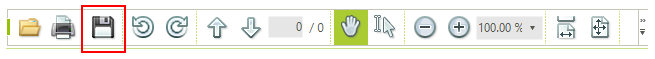

# Save Programmatically

The __SaveDocument__ method allows you to save the currently loaded document in an new file:

#### Using SaveDocument method.

{{source=..\SamplesCS\PdfViewer\RotationAndExport.cs region=RotateMethod}} 
{{source=..\SamplesVB\PdfViewer\RotationAndExport.vb region=RotateMethod}} 

{{endregion}}

You can use the __GetDocumentAsStream__ method to retrieve the document stream:

#### Get the document stream

{{source=..\SamplesCS\PdfViewer\RotationAndExport.cs region=RotateMethod}} 
{{source=..\SamplesVB\PdfViewer\RotationAndExport.vb region=RotateMethod}} 

{{endregion}}

## Save from the PdfViewerNavigator

The PdfViewerNavigator has a save as button that can be used for saving the document as well.

        
