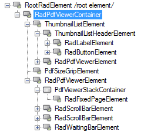

# Structure

This article describes the logical and visual structure of __RadPdfViewer__.

## Document model

### RadFixedDocument

When __LoadDocument__ finishes loading a document, a new RadFixedDocument instance is created. RadFixedDocument represent logically a single PDF document. The members that RadFixedDocument exposes are:

* __Pages__: A collection of __RadFixedPage__ items created for the current document in the viewer.

* __Selection__: Information about the current selection in the document.

* __Annotations__: A collection of all annotations (such as links) in the current document.

* __Destinations__: A collection of all destinations (roughly said “bookmarks”) in the document that have links to them.

* __CaretPosition__: The current position of the caret.

### RadFixedPage

RadFixedPage represents logically a single page of a document. The __Pages__ collection of RadFixedDocument consists of such objects and they are used as data items by the virtualized __RadFixedPageElement__.

## Element structure

__RadPdfViewer__ has the following element structure:

>caption Figure 1: RadPdfViewer`s Element Hierarchy

>caption Figure 2: RadPdfViewer`s Structure

1. __RadPdfViewerContainer__: Container element.

1. __RadPdfViewerElement__: Main UI element responsible for dispaying the pages.

1. __RadFixedPageElement__: Represents an element which displays a single PDF page.

1. __RadScrollBarElement__: Elements representing the horizontal or vertical scroll which allows you to pan and scroll the document.

1. __ThumbnailListElement__: Main UI element holding the page thumbnails.

1. __ThumbnailListHeaderElement__: Header element.

1. __RadLabelElement__: Displays a title.

1. __RadButtonElement__: Button element responsible for showing or hiding the thumbnails.

* __PdfViewerStackContainer__: Represents a virtualized container for __RadFixedPageElements__.

* __RadWaitingBarElement__: Waiting indicator which is only visible while loading a document.

## See Also

* [Smart Tag]()
* [Getting Started]()