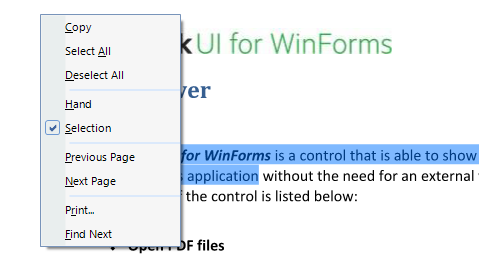

# Context Menu 

__RadPdfViewer__ has a default context menu - __PdfViewerContextMenu__ which provides a quick way of performing a number of commands. However, you can replace this menu with a custom one by setting the __RadContextMenu__ property of the __RadPdfViewer__.

#### New Context Menu

{{source=..\SamplesCS\PdfViewer\PdfPublicApi.cs region=ChangeContextMenu}} 
{{source=..\SamplesVB\PdfViewer\PdfPublicApi.vb region=ChangeContextMenu}} 

````C#
this.radPdfViewer1.RadContextMenu = this.radContextMenu1;

````
````VB.NET
Me.radPdfViewer1.RadContextMenu = Me.radContextMenu1

````

{{endregion}}

You can also use the __ShowMenu__ method to show the context menu programmatically at a specified location.

#### Show Context Menu

{{source=..\SamplesCS\PdfViewer\PdfPublicApi.cs region=ShowContextMenu}} 
{{source=..\SamplesVB\PdfViewer\PdfPublicApi.vb region=ShowContextMenu}} 

````C#
private void buttonShowMenu_Click(object sender, EventArgs e)
{
    this.radPdfViewer1.PdfViewerElement.ShowMenu(new Point(100, 100));
}

````
````VB.NET
Private Sub buttonShowMenu_Click(sender As Object, e As EventArgs) Handles buttonShowMenu.Click
    Me.radPdfViewer1.PdfViewerElement.ShowMenu(New Point(100, 100))
End Sub

````

{{endregion}}

The context menu can change dynamically. For example, when the Text Selection mode is enabled, *Copy* and *Select All* items are displayed in the menu with a separator below them:

|FixedDocumentViewerMode.Pan|FixedDocumentViewerMode.TextSelection|
|----|----|
|||
 
Additionally, you can easily add a custom menu item to the context menu. You can find below a sample code snippet:

#### Add New Menu Item

{{source=..\SamplesCS\PdfViewer\PdfUI.cs region=CustomContextMenuItem}} 
{{source=..\SamplesVB\PdfViewer\PdfUI.vb region=CustomContextMenuItem}} 

````C#
public PdfUI()
{
    InitializeComponent();
    RadMenuItem item = new RadMenuItem("MyItem");
    item.Click += item_Click;
    this.radPdfViewer1.PdfViewerElement.ContextMenu.Items.Add(item);
}
private void item_Click(object sender, EventArgs e)
{
    RadMessageBox.Show("Perform your custom action here");
}

````
````VB.NET
Public Sub New()
    InitializeComponent()
    Dim item As New RadMenuItem("MyItem")
    AddHandler item.Click, AddressOf item_Click
    Me.RadPdfViewer1.PdfViewerElement.ContextMenu.Items.Add(item)
End Sub
Private Sub item_Click(sender As Object, e As EventArgs)
    RadMessageBox.Show("Perform your custom action here")
End Sub

````

{{endregion}}

# See Also

* [Getting Started]()
* [Document Modes]()
* [View Modes]()