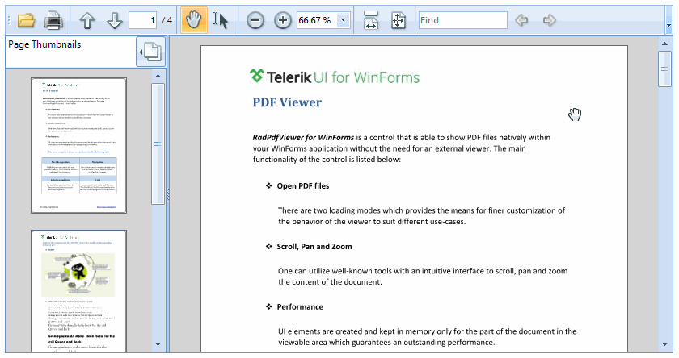
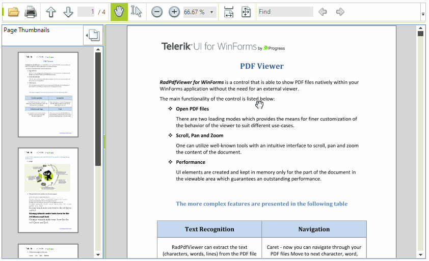
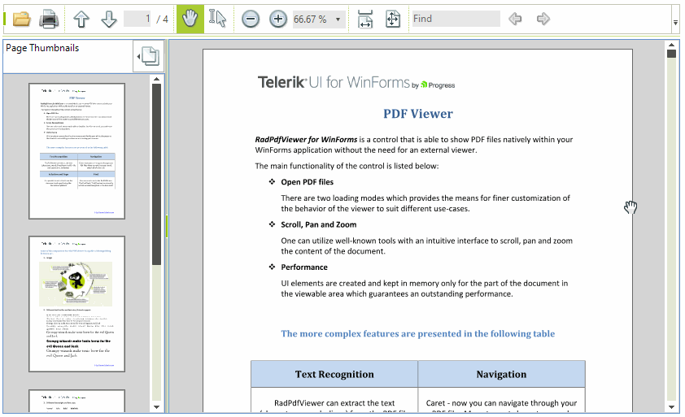

# Document Presenters 

The document presenter is responsible for displaying the pages of the document, navigating in it, managing the selection markers, conversion between view coordinates and document location coordinates, plus proper response to mouse and touch events.

## Pages Presenter

This document presenter displays the pages in a vertical order and is used by default by __RadPdfViewer__. There is a fixed margin between the pages, and each page is centered horizontally inside the __RadPdfViewer__.  



## Single Page Presenter (Fit Full Page)

This document presenter displays a single page at a time inside the viewer. The page is vertically and horizontally centered. In order to enable this mode, set the __FitFullPage__ property to *true*.

{{source=..\SamplesCS\PdfViewer\PdfUI.cs region=FitFullPage}} 
{{source=..\SamplesVB\PdfViewer\PdfUI.vb region=FitFullPage}} 

````C#
this.radPdfViewer1.FitFullPage = true; 
````
````VB.NET
Me.RadPdfViewer1.FitFullPage = True  
````

{{endregion}}



## Fit Full Width

This mode fills the window with each page and scroll through pages continuously. 

{{source=..\SamplesCS\PdfViewer\PdfUI.cs region=FitToWidth}} 
{{source=..\SamplesVB\PdfViewer\PdfUI.vb region=FitToWidth}} 

````C#
this.radPdfViewer1.FitFullPage = true;
````
````VB.NET
Me.RadPdfViewer1.FitToWidth = True 
````

{{endregion}}

