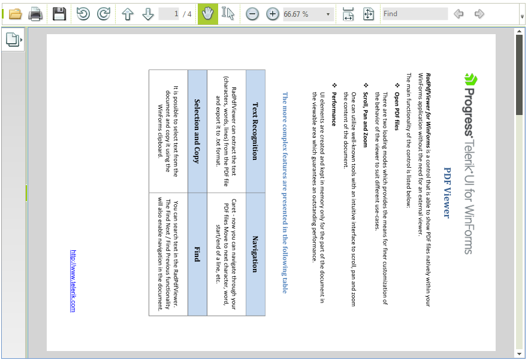

# Rotation

**RadPdfViewer** provides functionality for rotating the pages of the loaded document. You can programmatically rotate the document pages through the **RadPdfViewer** class.

 

## Rotation Using RadPdfViewer

__RadPdfViewer__ has a __Rotate()__ method intended to rotate the pages of the loaded document at the specified angle relative to its initial position. The method takes a single argument of type __RotationAngle__. Alternatively, you can use the **RotationAngle** property.
        
__RotationAngle__ is an enumeration that specifies the angle at which the document should be rotated. The possible values are *Degrees0*, *Degrees90*, *Degrees180*, *Degrees270*.

#### RotationAngle

{{source=..\SamplesCS\PdfViewer\PdfUI.cs region=Rotate}} 
{{source=..\SamplesVB\PdfViewer\PdfUI.vb region=Rotate}} 

````C# 
this.radPdfViewer1.Rotate(Telerik.WinControls.UI.RotationAngle.Degrees90);
````
````VB.NET 
Me.RadPdfViewer1.Rotate(RotationAngle.Degrees90)
````

{{endregion}}

The current angle at which the pages are rotated can be retrieved using the read-only **RotationAngle** property of **RadPdfViewer**.
