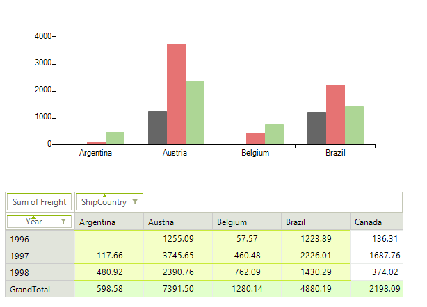

# Binding with RadChartView

The reports generated by **RadPivotGrid** can be easily visualized in [RadChartView](). To do this, you simply need to assign a RadPivotGrid instance as a __DataSource__ of RadChartView:

#### Setting RadChartView Data Source

{{source=..\SamplesCS\PivotGrid\PivotGridBindingWithChart.cs region=SetDataSource}} 
{{source=..\SamplesVB\PivotGrid\PivotGridBindingWithChart.vb region=SetDataSource}} 

````C#
this.radChartView1.DataSource = this.radPivotGrid1;

````
````VB.NET
Me.radChartView1.DataSource = Me.radPivotGrid1

````

{{endregion}}

>caption Figure 1: Associating a Chart


Populating **RadChartView** with data is performed by a __PivotGridChartDataProvider__ object. It provides several properties for customizing its behavior. You can access this object by the __ChartDataProvider__ property of **RadPivotGrid**.

## Provider Settings

In some cases, including the __SubTotal__ and __GrandTotal__ values in the visualization is not needed as they can be simply the sum of all previous values. In this case, you can use the following properties to indicate which kind of totals to be displayed:

#### Totals Settings

{{source=..\SamplesCS\PivotGrid\PivotGridBindingWithChart.cs region=ChooseDisplayedTotals}} 
{{source=..\SamplesVB\PivotGrid\PivotGridBindingWithChart.vb region=ChooseDisplayedTotals}} 

````C#
this.radPivotGrid1.ChartDataProvider.IncludeColumnSubTotals = false;
this.radPivotGrid1.ChartDataProvider.IncludeRowSubTotals = false;
this.radPivotGrid1.ChartDataProvider.IncludeColumnGrandTotals = false;
this.radPivotGrid1.ChartDataProvider.IncludeRowSubTotals = false;

````
````VB.NET
Me.radPivotGrid1.ChartDataProvider.IncludeColumnSubTotals = False
Me.radPivotGrid1.ChartDataProvider.IncludeRowSubTotals = False
Me.radPivotGrid1.ChartDataProvider.IncludeColumnGrandTotals = False
Me.radPivotGrid1.ChartDataProvider.IncludeRowSubTotals = False

````

{{endregion}}


You can change the type of the generated series to one of the categorical types: __Bar, Line,  Area__. Additionally, you can choose which of the pivot axes will be used for generating series:

>tip __RadChartView__ provides out of the box support for data points having [null values](). In order to enable it when associated with __RadPivotGrid__ the __EnableNulls__ property of the provider should be set to *true*. 
>

>caption Figure 2: Line Series with Null Values


#### Series Type

{{source=..\SamplesCS\PivotGrid\PivotGridBindingWithChart.cs region=ChooseSeriesAndAxes}} 
{{source=..\SamplesVB\PivotGrid\PivotGridBindingWithChart.vb region=ChooseSeriesAndAxes}} 

````C#
this.radPivotGrid1.ChartDataProvider.GeneratedSeriesType = Telerik.WinControls.UI.GeneratedSeriesType.Line;
this.radPivotGrid1.ChartDataProvider.SeriesAxis = Telerik.Pivot.Core.PivotAxis.Rows;
this.radPivotGrid1.ChartDataProvider.EnableNulls = true;

````
````VB.NET
Me.radPivotGrid1.ChartDataProvider.GeneratedSeriesType = Telerik.WinControls.UI.GeneratedSeriesType.Line
Me.radPivotGrid1.ChartDataProvider.SeriesAxis = Telerik.Pivot.Core.PivotAxis.Rows
Me.radPivotGrid1.ChartDataProvider.EnableNulls = True

````

{{endregion}}

You have the option to choose whether the entire report should be visualized or only the selected parts of it. There is also an option to delay the updates so that **RadChartView** does not update constantly during selection.

#### Visualizing Data

{{source=..\SamplesCS\PivotGrid\PivotGridBindingWithChart.cs region=ConfigureReport}} 
{{source=..\SamplesVB\PivotGrid\PivotGridBindingWithChart.vb region=ConfigureReport}} 

````C#
this.radPivotGrid1.ChartDataProvider.SelectionOnly = true;
this.radPivotGrid1.ChartDataProvider.DelayUpdate = true;
this.radPivotGrid1.ChartDataProvider.DelayAmount = 500;

````
````VB.NET
Me.radPivotGrid1.ChartDataProvider.SelectionOnly = True
Me.radPivotGrid1.ChartDataProvider.DelayUpdate = True
Me.radPivotGrid1.ChartDataProvider.DelayAmount = 500

````

{{endregion}}

You can change the delimiter that is put between the group names when generating chart categories. This can be useful for avoiding confusion if the default dash delimiter (“-“) is used in some of the group names.

#### Group Names Delimiter

{{source=..\SamplesCS\PivotGrid\PivotGridBindingWithChart.cs region=SetDelimiter}} 
{{source=..\SamplesVB\PivotGrid\PivotGridBindingWithChart.vb region=SetDelimiter}} 

````C#
this.radPivotGrid1.ChartDataProvider.GroupNameDelimiter = " -> ";

````
````VB.NET
Me.radPivotGrid1.ChartDataProvider.GroupNameDelimiter = " -> "

````

{{endregion}}

## PivotGridChartDataProvider Events

There are two events that allow you to modify the settings of the generated series or to use custom series. The __SeriesCreating__ is fired when a series is being created and it allows you to replace the series instance with a custom one if needed. The __UpdateCompleted__ event is fired when all series have been generated so that you can apply to them any final settings.

#### Chart Events

{{source=..\SamplesCS\PivotGrid\PivotGridBindingWithChart.cs region=replaceOrModifySeries}} 
{{source=..\SamplesVB\PivotGrid\PivotGridBindingWithChart.vb region=replaceOrModifySeries}} 

````C#
void ChartDataProvider_UpdateCompleted(object sender, EventArgs e)
{
    if (this.radPivotGrid1.ChartDataProvider.GeneratedSeriesType != GeneratedSeriesType.Bar)
    {
        foreach (CartesianSeries series in this.radChartView1.Series)
        {
            series.CombineMode = ChartSeriesCombineMode.Stack;
        }
    }
}
void ChartDataProvider_SeriesCreating(object sender, Telerik.WinControls.UI.SeriesCreatingEventArgs e)
{
    e.Series = new BarSeries();
}

````
````VB.NET
Private Sub ChartDataProvider_UpdateCompleted(sender As Object, e As EventArgs)
    If Me.radPivotGrid1.ChartDataProvider.GeneratedSeriesType <> GeneratedSeriesType.Bar Then
        For Each series As CartesianSeries In Me.radChartView1.Series
            series.CombineMode = ChartSeriesCombineMode.Stack
        Next
    End If
End Sub
Private Sub ChartDataProvider_SeriesCreating(sender As Object, e As Telerik.WinControls.UI.SeriesCreatingEventArgs)
    e.Series = New BarSeries()
End Sub

````

{{endregion}}

# See Also

* [Drill Down]()
* [RadChartView]()
* [RadRangeSelector]()