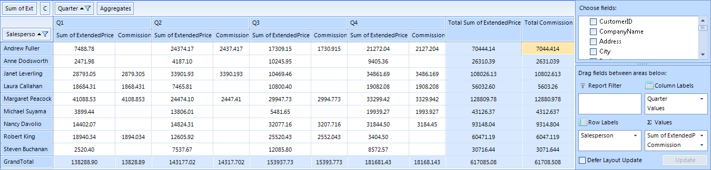

# Calculated fields


In this article you will find out how to extend RadPivotGrid's generated report by adding __Calculated Fields__.
      

## Calculated Fields Description

If your data analysis requires results that are not available using just the data source fields and RadPivotGrid's built-in calculations, you can insert a calculated field that uses a custom formula to derive the results you need. A calculated field is a new data field in which the values are the result of a custom calculation formula. You can display the calculated field along with another data field or on its own. A calculated field is really a custom summary calculation, so in almost all cases, the calculated field references one or more fields in the source data.

## Calculated Fields Description

All Calculated Fields that you have added to your __LocalDataSourceProvider__ will be visible in __RadPivotFieldList__, so the user will be able to add and remove them at runtime. In order to add a calculated field to __LocalDataSourceProvider__ you have to add it to its __CalculatedFields__ collection. So first you have to create a concrete class that implements the abstract class __CalculatedField__. This requires the implementation of two methods - __CalculatedValue__ and __RequiredFields__. __CalculateValue__ is the method in which you have to define your calculation formula and create a new __AggregateValue__ that will be shown in __RadPivotGrid__. In common scenario a Calculated Field reference one or more fields in the data source. The __RequiredFields__ method should return __IEnumerable__ of the required fields. That's why we have added a new class called __RequiredField__. It's purpose is to describe a field, required for a calculated field. __RequiredField__ can be created for property from the data object or for another calculated field. Name property of __CalculatedField__ class identifies its unique name that will be shown in the UI.

The first task is to decide what the calculation formula that you want to use is. For example, you can show the commission that will be paid to all salespeople. Commission will be paid only to those who have more sold for more than $15 000.The price of the sold items is kept by the __ExtendedPrice__ property from the source. So the new class will look like this:

{{source=..\SamplesCS\PivotGrid\PivotGridCalculatedFields.cs region=CalculatedFieldClass}} 
{{source=..\SamplesVB\PivotGrid\PivotGridCalculatedFields.vb region=CalculatedFieldClass}} 

````C#
public class CommissionCalculatedField : CalculatedField
{
    private RequiredField extendPriceField;
    public CommissionCalculatedField()
    {
        this.Name = "Commission";
        this.extendPriceField = RequiredField.ForProperty("ExtendedPrice");
    }
    protected override IEnumerable<RequiredField> RequiredFields()
    {
        yield return this.extendPriceField;
    }
    protected override AggregateValue CalculateValue(IAggregateValues aggregateValues)
    {
        var aggregateValue = aggregateValues.GetAggregateValue(this.extendPriceField);
        if (aggregateValue.IsError())
        {
            return aggregateValue;
        }
        double extendedPrice = aggregateValue.ConvertOrDefault<double>();
        if (extendedPrice > 15000)
        {
            return new DoubleAggregateValue(extendedPrice * 0.1);
        }
        return null;
    }
}

````
````VB.NET
Public Class CommissionCalculatedField
    Inherits CalculatedField
    Private extendPriceField As RequiredField
    Public Sub New()
        Me.Name = "Commission"
        Me.extendPriceField = RequiredField.ForProperty("ExtendedPrice")
    End Sub
    Protected Overrides Function RequiredFields() As IEnumerable(Of RequiredField)
        Return New List(Of RequiredField) From {extendPriceField}
    End Function
    Protected Overrides Function CalculateValue(aggregateValues As IAggregateValues) As AggregateValue
        Dim aggregateValue = aggregateValues.GetAggregateValue(Me.extendPriceField)
        If aggregateValue.IsError() Then
            Return aggregateValue
        End If
        Dim extendedPrice As Double = aggregateValue.ConvertOrDefault(Of Double)()
        If extendedPrice > 15000 Then
            Return New DoubleAggregateValue(extendedPrice * 0.1)
        End If
        Return Nothing
    End Function
End Class

````

{{endregion}} 


Now it is time to add a new instance of this class to the CalculatedFields collection of LocalDataSourceProvider:

{{source=..\SamplesCS\PivotGrid\PivotGridCalculatedFields.cs region=AddCalculatedField}} 
{{source=..\SamplesVB\PivotGrid\PivotGridCalculatedFields.vb region=AddCalculatedField}} 

````C#
  using (radPivotGrid1.PivotGridElement.DeferRefresh())
  {
      CommissionCalculatedField calculatedField = new CommissionCalculatedField();
      calculatedField.Name = "Commission";
      ((LocalDataSourceProvider)this.radPivotGrid1.DataProvider).CalculatedFields.Add(calculatedField);
  }

````
````VB.NET
Using radPivotGrid1.PivotGridElement.DeferRefresh()
    Dim calculatedField As New CommissionCalculatedField()
    calculatedField.Name = "Commission"
    DirectCast(Me.radPivotGrid1.DataProvider, LocalDataSourceProvider).CalculatedFields.Add(calculatedField)
End Using

````

{{endregion}}

>important If you add calculated fields in code behind, you have to set the __ItemsSource__ of __LocalDataSourceProvider__ after  you have added all calculated fields or to wrap the code between (including setting the __ItemsSource__ ) __BeginInit() - EndInit()__ methods (or inside __using DeferRefresh() { ... }__ section ).
>

