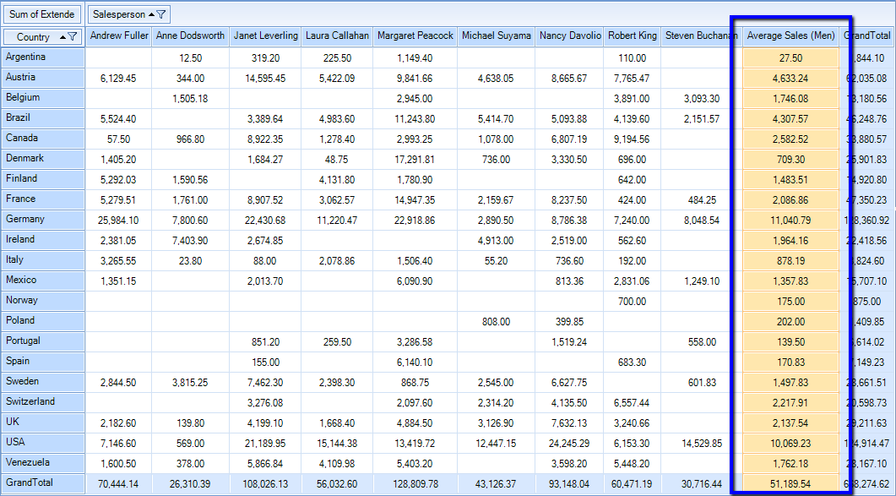

# Calculated items

A calculated item is a new item in a row or column field in which the values are the result of a custom calculation.
        In this case, the calculated item’s formula references one or more items in the same field.
        
        By using Calculated Items you are able to extend __RadPivotGrid__ with additional items 
        that are not part of the data source.
      

## Defining Calculated Item

With __RadPivotGrid__ you are able to create different Groups that will be shown in Rows and Columns. 
          But in some cases you may need to show additional items for specific group. In this case you may use Calculated Items.
          Calculated Items are added to a group description and they have access to different items from the same group.
          For example, lets say we want to calculate the average sales made by some of the sales people, but not all of them. 
          First we have to create a concrete class that implements the abstract *CalculatedItem* class.
          
          For this purpose the new class must implement GetValue method. In our scenario we'll show the average sales of four 
          of the sales people:
        

#### __[C#] __

{{source=..\SamplesCS\PivotGrid\PivotGridCalculatedItems.cs region=CalculatedItemClasses}}
	    public class MenAverageSales : CalculatedItem
	    {
	        protected override AggregateValue GetValue(IAggregateSummaryValues aggregateSummaryValues)
	        {
	            AggregateValue[] aggregateValues = {
	            aggregateSummaryValues.GetAggregateValue("Andrew Fuller"),
	            aggregateSummaryValues.GetAggregateValue("Michael Suyama"),
	            aggregateSummaryValues.GetAggregateValue("Robert King"),
	            aggregateSummaryValues.GetAggregateValue("Steven Buchanan")
	        };
	
	            if (aggregateValues.ContainsError())
	            {
	                return AggregateValue.ErrorAggregateValue;
	            }
	
	            double average = aggregateValues.Average(av => av.ConvertOrDefault<double>());
	            return new DoubleAggregateValue(average);
	        }
	    }
	{{endregion}}

#### __[VB.NET] __

{{source=..\SamplesVB\PivotGrid\PivotGridCalculatedItems.vb region=CalculatedItemClasses}}
	Public Class MenAverageSales
	    Inherits CalculatedItem
	    Protected Overrides Function GetValue(aggregateSummaryValues As IAggregateSummaryValues) As AggregateValue
	        Dim aggregateValues As AggregateValue() = {aggregateSummaryValues.GetAggregateValue("Andrew Fuller"), aggregateSummaryValues.GetAggregateValue("Michael Suyama"), aggregateSummaryValues.GetAggregateValue("Robert King"), aggregateSummaryValues.GetAggregateValue("Steven Buchanan")}
	
	        If aggregateValues.ContainsError() Then
	            Return AggregateValue.ErrorAggregateValue
	        End If
	
	        Dim average As Double = aggregateValues.Average(Function(av) av.ConvertOrDefault(Of Double)())
	        Return New DoubleAggregateValue(average)
	    End Function
	End Class
	{{endregion}}

As you can see the Calculated Item will show the average sales of four people. Now we just have to add it to
          the PropertyGroupDescription. In our case this will be the Salesperson group:
        

#### __[C#] __

{{source=..\SamplesCS\PivotGrid\PivotGridCalculatedItems.cs region=AddCalcItemWithoutSortOrder}}
	            PropertyGroupDescription salesPersonGroupDescription = new PropertyGroupDescription();
	            salesPersonGroupDescription.PropertyName = "Salesperson";
	
	            MenAverageSales calculatedItem = new MenAverageSales();
	            calculatedItem.GroupName = "Average Sales (Men)";
	            salesPersonGroupDescription.CalculatedItems.Add(calculatedItem);
	            localProvider.ColumnGroupDescriptions.Add(salesPersonGroupDescription);
	{{endregion}}

#### __[VB.NET] __

{{source=..\SamplesVB\PivotGrid\PivotGridCalculatedItems.vb region=AddCalcItemWithoutSortOrder}}
	        Dim salesPersonGroupDescription As New PropertyGroupDescription()
	        salesPersonGroupDescription.PropertyName = "Salesperson"
	
	        Dim calculatedItem As New MenAverageSales()
	        calculatedItem.GroupName = "Average Sales (Men)"
	        salesPersonGroupDescription.CalculatedItems.Add(calculatedItem)
	        localProvider.ColumnGroupDescriptions.Add(salesPersonGroupDescription)
	{{endregion}}

## Add Calculated Items at runtime

Calculated items can be added only to Group Descriptions. If you are using __RadPivotFieldList__ the users can remove
          the group for which you've added calculated items and this way the calculated items will be removed as well. Adding the same group in rows or columns will not show
          the calculated items anymore. In order to add them again you have to use *PrepareDescriptionForField*
          event of LocalDataSourceProvider and add the calculated items to the description:
        

#### __[C#] __

{{source=..\SamplesCS\PivotGrid\PivotGridCalculatedItems.cs region=localProvider_PrepareDescriptionForField}}
	        void localProvider_PrepareDescriptionForField(object sender, PrepareDescriptionForFieldEventArgs e)
	        {
	            if (e.DescriptionType == DataProviderDescriptionType.Group && e.FieldInfo.DisplayName == "Salesperson")
	            {
	                var description = e.Description as Telerik.Pivot.Core.PropertyGroupDescription;
	
	                if (description != null)
	                {
	                    var calculatedItem = new MenAverageSales();
	                    calculatedItem.GroupName = "Average Sales (Men)";
	                    description.CalculatedItems.Add(calculatedItem);
	                }
	            }
	        }
	{{endregion}}

#### __[VB.NET] __

{{source=..\SamplesVB\PivotGrid\PivotGridCalculatedItems.vb region=localProvider_PrepareDescriptionForField}}
	    Private Sub localProvider_PrepareDescriptionForField(sender As Object, e As PrepareDescriptionForFieldEventArgs)
	        If e.DescriptionType = DataProviderDescriptionType.Group AndAlso e.FieldInfo.DisplayName = "Salesperson" Then
	            Dim description = TryCast(e.Description, Telerik.Pivot.Core.PropertyGroupDescription)
	
	            If description IsNot Nothing Then
	                Dim calculatedItem = New MenAverageSales()
	                calculatedItem.GroupName = "Average Sales (Men)"
	                description.CalculatedItems.Add(calculatedItem)
	            End If
	        End If
	    End Sub
	{{endregion}}

## Solve Order

If you have calculated items in both rows and columns group descriptions, you have to define which of them will be used for the intersected cells. That's why each Calculated Item has *SolveOrder*
          property - when a cell is an intersection between two calculated items the one with higher solve order will be used.
        

#### __[C#] __

{{source=..\SamplesCS\PivotGrid\PivotGridCalculatedItems.cs region=AddCalcItemWithSortOrder}}
	            PropertyGroupDescription salesPersonGroupDescription = new PropertyGroupDescription();
	            salesPersonGroupDescription.PropertyName = "Salesperson";
	
	            MenAverageSales menAvgSalesCalculatedItem  = new MenAverageSales();
	            menAvgSalesCalculatedItem .GroupName = "Average Sales (Men)";
	            menAvgSalesCalculatedItem .SolveOrder = 1;
	            salesPersonGroupDescription.CalculatedItems.Add(menAvgSalesCalculatedItem);
	
	            PropertyGroupDescription countryGroupDescription = new PropertyGroupDescription();
	            countryGroupDescription.PropertyName = "Country";
	            CA caCalculatedItem = new CA();
	            caCalculatedItem.GroupName = "CA";
	            caCalculatedItem.SolveOrder = 2;
	            countryGroupDescription.CalculatedItems.Add(caCalculatedItem);
	
	
	            localProvider.ColumnGroupDescriptions.Add(salesPersonGroupDescription);
	            localProvider.RowGroupDescriptions.Add(countryGroupDescription);
	{{endregion}}

#### __[VB.NET] __

{{source=..\SamplesVB\PivotGrid\PivotGridCalculatedItems.vb region=AddCalcItemWithSortOrder}}
	        Dim salesPersonGroupDescription As New PropertyGroupDescription()
	        salesPersonGroupDescription.PropertyName = "Salesperson"
	
	        Dim menAvgSalesCalculatedItem As New MenAverageSales()
	        menAvgSalesCalculatedItem.GroupName = "Average Sales (Men)"
	        menAvgSalesCalculatedItem.SolveOrder = 1
	        salesPersonGroupDescription.CalculatedItems.Add(menAvgSalesCalculatedItem)
	
	        Dim countryGroupDescription As New PropertyGroupDescription()
	        countryGroupDescription.PropertyName = "Country"
	        Dim caCalculatedItem As New CA()
	        caCalculatedItem.GroupName = "CA"
	        caCalculatedItem.SolveOrder = 2
	        countryGroupDescription.CalculatedItems.Add(caCalculatedItem)
	
	
	        localProvider.ColumnGroupDescriptions.Add(salesPersonGroupDescription)
	        localProvider.RowGroupDescriptions.Add(countryGroupDescription)
	{{endregion}}

Here is the result:
        

As you can see the intersected cell between the two calculated items has value 500 as the CA calculated item has higher solve order. If we change the solve order of Men Average Sales to a higher value,
          for example 5, here is how __RadPivotGrid__ will look like:
        
