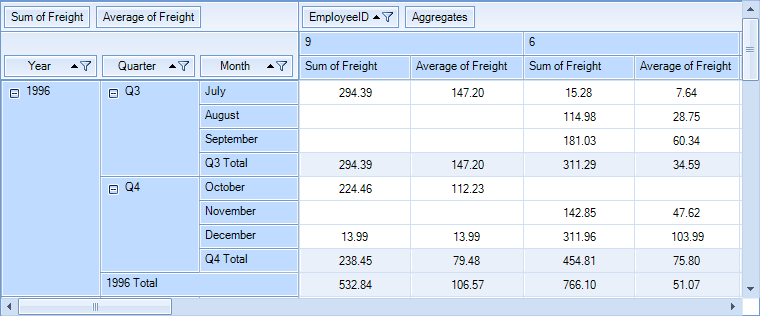
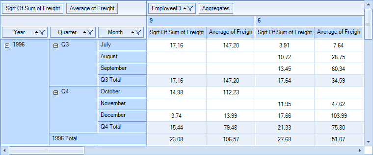

# Custom Aggregation

__RadPivotGrid__ is designed to aggregate data and it provides an API for assigning special aggregation functions performing custom calculations. For the purpose of this example we will use a __LocalDataSourceProvider__ object and we will bind the pivot control to the *Orders* table from the *Northwind* database as explained [here]().

>caption Figure 1: Using the Built-in *Sum* function
>

>caption Figure 2: Using the Custom *Sqrt Of Sum* function
>

## Defining a Custom Aggregation Function

Our new function will be almost the same as the already available __AggregateFunctions.Sum__, with the important difference that it will calculate not the sum of the items, but the sum of their square roots.

#### Custom Function Logic

{{source=..\SamplesCS\PivotGrid\PivotGridCustomAggregation.cs region=AggregateFunction}} 
{{source=..\SamplesVB\PivotGrid\PivotGridCustomAggregation.vb region=AggregateFunction}}
````C#
````
````VB.NET
````

{{endregion}}

## Defining a Custom Aggregate Value

We also need to create a custom aggregate value class which will be used by our newly defined function to perform the actual calculation. 

#### Custom Aggregate Logic

{{source=..\SamplesCS\PivotGrid\PivotGridCustomAggregation.cs region=AggregateValue}} 
{{source=..\SamplesVB\PivotGrid\PivotGridCustomAggregation.vb region=AggregateValue}}
````C#
````
````VB.NET
````

{{endregion}}

## Assigning the Custom Function

We can make use of our new function by assigning it to the __AggregateFunction__ property of a __PropertyAggregateDescription__ object before setting it to our pivot.

#### Using the Custom Aggregate Function

{{source=..\SamplesCS\PivotGrid\PivotGridCustomAggregation.cs region=CustomFunctionUsage}} 
{{source=..\SamplesVB\PivotGrid\PivotGridCustomAggregation.vb region=CustomFunctionUsage}}
````C#
LocalDataSourceProvider dataProvider = new LocalDataSourceProvider();
dataProvider.ItemsSource = dataset.Orders;
dataProvider.AggregateDescriptions.Add(new PropertyAggregateDescription() { PropertyName = "Freight", AggregateFunction = new SqrtSumAggregateFunction() });
this.radPivotGrid1.DataProvider = dataProvider;

````
````VB.NET
Dim dataProvider As New LocalDataSourceProvider()
dataProvider.ItemsSource = dataset.Orders
dataProvider.AggregateDescriptions.Add(New PropertyAggregateDescription() With { _
.PropertyName = "Freight", _
.AggregateFunction = AggregateFunctions.Sum _
})
Me.RadPivotGrid1.DataProvider = dataProvider

```` 

{{endregion}}

* [Calculated Fields]()
* [Calculated Items]()