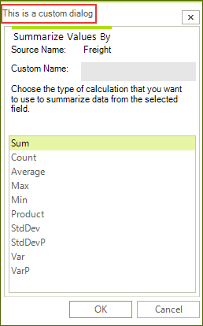

# Customizing the Dialogs


## 

To customize the dialogs in RadPivotGrid/RadPivotFieldList, you can either inherit from them to override/extend the base functionality or you can create an entirely custom dialogs by implementing the corresponding dialog interface.

{{source=..\SamplesCS\PivotGrid\PivotGridDialogs.cs region=MyAggregateOptionsDialog}} 
{{source=..\SamplesVB\PivotGrid\PivotGridDialogs.vb region=MyAggregateOptionsDialog}} 

````C#
class MyAggregateOptionsDialog : AggregateOptionsDialog
{
    public override void LoadSettings(Telerik.Pivot.Core.PropertyAggregateDescriptionBase aggregateDescription)
    {
        base.LoadSettings(aggregateDescription);
        this.Text = "This is a custom dialog";
    }
}

````
````VB.NET
Class MyAggregateOptionsDialog
    Inherits AggregateOptionsDialog
    Public Overrides Sub LoadSettings(aggregateDescription As Telerik.Pivot.Core.PropertyAggregateDescriptionBase)
        MyBase.LoadSettings(aggregateDescription)
        Me.Text = "This is a custom dialog"
    End Sub
End Class

````

{{endregion}}

When RadPivotGrid and RadPivotFieldList need a dialog, they use the __PivotGridDialogsFactory__ to create an instance of a dialog. To replace the default dialogs with your custom ones, you need to implement a custom factory as show below.

{{source=..\SamplesCS\PivotGrid\PivotGridDialogs.cs region=MyDialogsFactory}} 
{{source=..\SamplesVB\PivotGrid\PivotGridDialogs.vb region=MyDialogsFactory}} 

````C#
class MyDialogsFactory : PivotGridDialogsFactory
{
    public override IAggregateOptionsDialog CreateAggregateOptionsDialog()
    {
        return new MyAggregateOptionsDialog();
    }
}

````
````VB.NET
Class MyDialogsFactory
    Inherits PivotGridDialogsFactory
    Public Overrides Function CreateAggregateOptionsDialog() As IAggregateOptionsDialog
        Return New MyAggregateOptionsDialog()
    End Function
End Class

````

{{endregion}}

Then, you need to assign it to RadPivotGrid and RadPivotFieldList:

{{source=..\SamplesCS\PivotGrid\PivotGridDialogs.cs region=SetFactories}} 
{{source=..\SamplesVB\PivotGrid\PivotGridDialogs.vb region=SetFactories}} 

````C#
this.radPivotGrid1.DialogsFactory = new MyDialogsFactory();
this.radPivotFieldList1.DialogsFactory = new MyDialogsFactory();

````
````VB.NET
Me.radPivotGrid1.DialogsFactory = New MyDialogsFactory()
Me.radPivotFieldList1.DialogsFactory = New MyDialogsFactory()

````

{{endregion}} 

