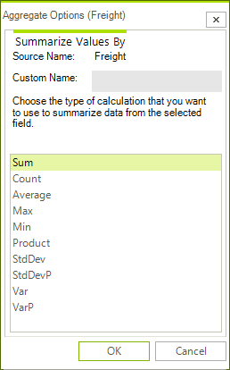
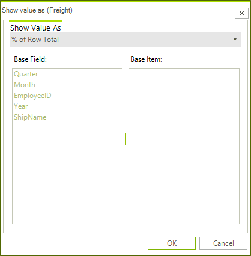
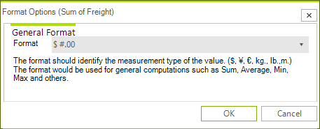
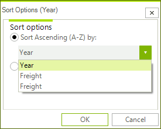
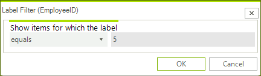
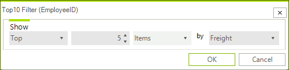

# Dialogs

There are several different dialogs which allow the end user to modify various settings in **RadPivotGrid**. The dialogs can be opened from the menus in **RadPivotGrid** or **RadPivotFieldList**. Each dialog implements a specific interface which will allow you to replace the default dialogs with custom implemented ones.

## AggregateOptionsDialog

The __AggregateOptionsDialog__ allows the end-user to change the aggregate function of an aggregate description as well as set a custom name for it. This dialog is opened from the __Aggregates__ list in RadPivotFieldList. The __AggregateOptionsDialog__ implements the __IAggregateOptionsDialog__ interface. 

>caption Figure 1: AggregateOptionsDialog

## CalculationOptionsDialog

The __CalculationOptionsDialog__ allows the end-user to change the way that values are calculated. There are various calculation options like *% Of, Running Totals, Rank, Index, etc*. This dialog is opened from the __Aggregates__ list in RadPivotFieldList. The __CalculationOptionsDialog__ implements the __ICalculationOptionsDialog__ interface.

>caption Figure 2: CalculationOptionsDialog 

## NumberFormatOptionsDialog

The __NumberFormatOptionsDialog__ allows the end-user set a format string for the calculated values. There are several predefined strings in the drop-down and any custom string can be entered in the editor as well. This dialog is opened from the __Aggregates__ list in RadPivotFieldList. The __NumberFormatOptionsDialog__ implements the __INumberFormatOptionsDialog__ interface.

>caption Figure 3: NumberFormatOptionsDialog

## SortOptionsDialog

The __SortOptionsDialog__ allows the end-user to select order in which the groups generated by a given group descriptor are sorted. They can be sorted alphabetically by their names or ascending/descending by the values of the aggregates for the groups. This dialog can be opened either from the RadPivotFieldList or from the drop-down menu of the group descriptors in RadPivotGrid. The __SortOptionsDialog__ implements the __ISortOptionsDialog__ interface.

>caption Figure 4: SortOptionsDialog

## LabelFilterOptionsDialog

The __LabelFilterOptionsDialog__ allows the end-user to select the filter function applied to the labels of the groups when using __Group Filtering__ or the fields of the items when using __Report Filtering__. The __LabelFilterOptionsDialog__ implements the __ILabelFilterOptionsDialog__ interface.

>caption Figure 5: LabelFilterOptionsDialog

## ValueFilterOptionsDialog

The __ValueFilterOptionsDialog__ allows the end-user to select the filter function applied to the values of the groups when using values filters. The __ValueFilterOptionsDialog__ implements the __IValueFilterOptionsDialog__ interface.

>caption Figure 6: ValueFilterOptionsDialog

## Top10FilterOptionsDialog

The __Top10FilterOptionsDialog__ allows the end-user to set the Top10 filter applied to the values of the groups when using value filters. The __Top10FilterOptionsDialog__ implements the __ITop10FilterOptionsDialog__ interface.

>caption Figure 7: Top10FilterOptionsDialog

# See Also

* [Custom Dialogs]()