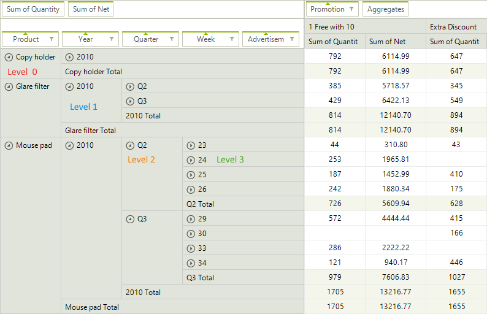

# Expand Behavior


In this article we will show you how to change the initial expand/collapse behavior of __RadPivotGrid__ rows and 
      columns.

>important Initial state is the state of __RadPivotGrid__ after refresh of the used data provider.
>


## GroupsExpandBehavior

In order to control the expand/collapse state of rows and columns in __RadPivotGrid__ you have to use an instance 
          of __GroupsExpandBehavior__ class from *Telerik.Pivot.Core* namespace.
          It has two properties that you can modify:
        

* __Expanded__ - bool property which controls the state. When it is *true* the groups 
              will be expanded. When the value is *false* the groups will be collapsed.
            

* __UpToLevel__ - integer property which controls the levels for which to apply the behavior.
            

You can combine the two properties to achieve the desired result. The default value of __Expanded__ property is
          *true*, so if you don't set it 
          (or if you do not set ExpandBehavior), all groups will be expanded. If you do not set __UpToLevel__, the behavior will be applied
          to all groups (which is its default state). For example, if you set Expanded = false and UpToLevel = 2, all levels up to the set one (levels
          0 and 1) will be collapsed, all groups with level greater than or equal to 2 will
          be expanded. So at initial state you will see all groups collapsed, but if you expand the first two levels, all other groups below them will
          be expanded.
        

## Set Expand Behavior

__RadPivotGrid__ has two properties to control the expand behavior - 
          __RowGroupsExpandBehavior__ and __ColumnGroupsExpandBehavior__.
          As you can guess, the first one controls the expand behavior of the rows and the second one - columns behavior. If you do not set 
          these properties, all groups in rows and columns will be expanded.
        #_C#_

	


{{source=..\SamplesCS\PivotGrid\ExpandBehavior.cs region=expand}} 
{{source=..\SamplesVB\PivotGrid\ExpandBehavior.vb region=expand}} 

````C#
            
            RadPivotGrid pivot = new RadPivotGrid();
            pivot.RowGroupsExpandBehavior = new GroupsExpandBehavior()
            {
                Expanded = false,
                UpToLevel = 2
            };
            pivot.ColumnGroupsExpandBehavior = new GroupsExpandBehavior() { Expanded = false };
````
````VB.NET

        Dim pivot As New RadPivotGrid()
        pivot.RowGroupsExpandBehavior = New GroupsExpandBehavior() With {.Expanded = False, .UpToLevel = 2}
        pivot.ColumnGroupsExpandBehavior = New GroupsExpandBehavior() With {.Expanded = False}

        '
````

{{endregion}} 


## Change Behavior at Runtime

If you want to collapse all groups in __RadPivotGrid__ you can change the behavior at runtime and refresh the data
          provider to apply the change immediately. For example, you may add two buttons in your application and
          handle the click event for each of them in order to expand/collapse the groups. Note that the new behavior will be applied each time 
          when the data provider is refreshed.
        #_C#_

	


{{source=..\SamplesCS\PivotGrid\ExpandBehavior.cs region=click}} 
{{source=..\SamplesVB\PivotGrid\ExpandBehavior.vb region=click}} 

````C#
        
        public void ExpandGroupsButton_Click(object sender, RoutedEventArgs e)
        {
            (this.pivot.RowGroupsExpandBehavior as GroupsExpandBehavior).Expanded = true;
            (this.pivot.ColumnGroupsExpandBehavior as GroupsExpandBehavior).Expanded = true;
            this.pivot.DataProvider.Refresh();
        }
        
        private void CollapseGroupsButton_Click(object sender, RoutedEventArgs e)
        {
            (this.pivot.RowGroupsExpandBehavior as GroupsExpandBehavior).Expanded = false;
            (this.pivot.ColumnGroupsExpandBehavior as GroupsExpandBehavior).Expanded = false;
            this.pivot.DataProvider.Refresh();
        }
````
````VB.NET

    Public Sub ExpandGroupsButton_Click(ByVal sender As Object, ByVal e As RoutedEventArgs)
        TryCast(Me.pivot.RowGroupsExpandBehavior, GroupsExpandBehavior).Expanded = True
        TryCast(Me.pivot.ColumnGroupsExpandBehavior, GroupsExpandBehavior).Expanded = True
        Me.pivot.DataProvider.Refresh()
    End Sub

    Private Sub CollapseGroupsButton_Click(ByVal sender As Object, ByVal e As RoutedEventArgs)
        TryCast(Me.pivot.RowGroupsExpandBehavior, GroupsExpandBehavior).Expanded = False
        TryCast(Me.pivot.ColumnGroupsExpandBehavior, GroupsExpandBehavior).Expanded = False
        Me.pivot.DataProvider.Refresh()
    End Sub

    '
````

{{endregion}} 


