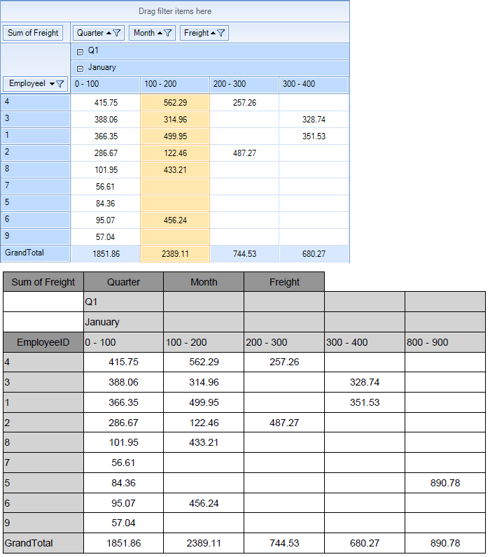

# Export to Pdf

__RadPivotGrid__ can export its contents to PDF. This is achieved with the help of the [RadPdfProcessing]() library. <br>

>note The PDF export functionality is located in the __TelerikExport.dll__ assembly and to use the functionality you need yo add reference to it.
>

## Execute the Exporter

Before exporting to PDF, you have to initialize the __PivotGridPdfExport__ class. The constructor takes one parameter - __RadPivotGrid__ which will be exported. You need to create  __PdfExportRenderer__ instance as well:

{{source=..\SamplesCS\Pivotgrid\PdfExportCode.cs region=RunExport}} 
{{source=..\SamplesVB\Pivotgrid\PdfExportCode.vb region=Runexport}} 

````C#
PivotGridPdfExport exporter = new PivotGridPdfExport(radPivotGrid1);
PdfExportRenderer renderer = new PdfExportRenderer();
exporter.RunExport(@"C:\PivotData.pdf", renderer);

````
````VB.NET
Dim exporter As New PivotGridPdfExport(radPivotGrid1)
Dim renderer As New PdfExportRenderer()
exporter.RunExport("C:\PivotData.pdf", renderer)

````

{{endregion}} 

## Properties

* __ExportVisualSettings:__ Gets or sets a value indicating whether the visual settings should be exported.

* __ExportSelectionOnly:__  Gets or sets a value indicating whether to export only selection.

* __ExportFlatData:__ Gets or sets a value which indicates whether to export flat data (collapsed rows and columns).

* __PageSize:__ Gets or sets the page size in millimeters.

* __PageMargins:__  Gets or sets the margins of pages in millimeters.

* __FitToPageWidth:__ Gets or sets a value indicating whether the content of page should fit into the page width.

* __Scale:__ Gets or sets the document scaling. Default value is 1. For example, scale of 1.2f means 20% size increase.

* __ShowHeaderAndFooter:__ Gets or sets a value indicating whether header and footer should be exported.

* __ExportSettings:__ This property allows you to set the [document information]().

The following properties define color and font of the different cell elements: __CellBackColor__, __HeadersBackColor__, __DescriptorsBackColor__, __SubTotalsBackColor__, __GrandTotalsBackColor__, __BorderColor__, __HeaderCellsFont__, __DataCellsFont__

## Events

The __PivotGridPdfExport__ exposes tree events that allows you to change the exported document.

* __CellFormatting:__ This event is fired for every exported cell. It allows you to change the cells properties including its value.

* __CellPaint:__ Occurs after a cell is drawn. This event allows you to draw additional elements to the cell.

* __PdfExported:__ Occurs when the export process completes.

The __PdfExportRenderer__ is exposing two events as well. Detailed information is available here: [PdfExportRenderer]()

## Asynchronous Exporting

The __PivotGrid__ can be exported asynchronously as well. The following example shows how you can run the exporter asynchronously.

{{source=..\SamplesCS\Pivotgrid\PdfExportCode.cs region=Async}} 
{{source=..\SamplesVB\Pivotgrid\PdfExportCode.vb region=Async}} 

````C#
PivotGridPdfExport exporter = new PivotGridPdfExport(radPivotGrid1);
PdfExportRenderer renderer = new PdfExportRenderer();
exporter.RunExportAsync(@"C:\PivotData.pdf", renderer);

````
````VB.NET
Dim exporter As New PivotGridPdfExport(radPivotGrid1)
Dim renderer As New PdfExportRenderer()
exporter.RunExportAsync("C:\PivotData.pdf", renderer)

````

{{endregion}}

There are two events that can be used with the asynchronous export:

* __AsyncExportCompleted:__ Occurs when an asynchronous export operation is completed.

* __AsyncExportProgressChanged:__ Occurs when the progress of an asynchronous export operation changes.
