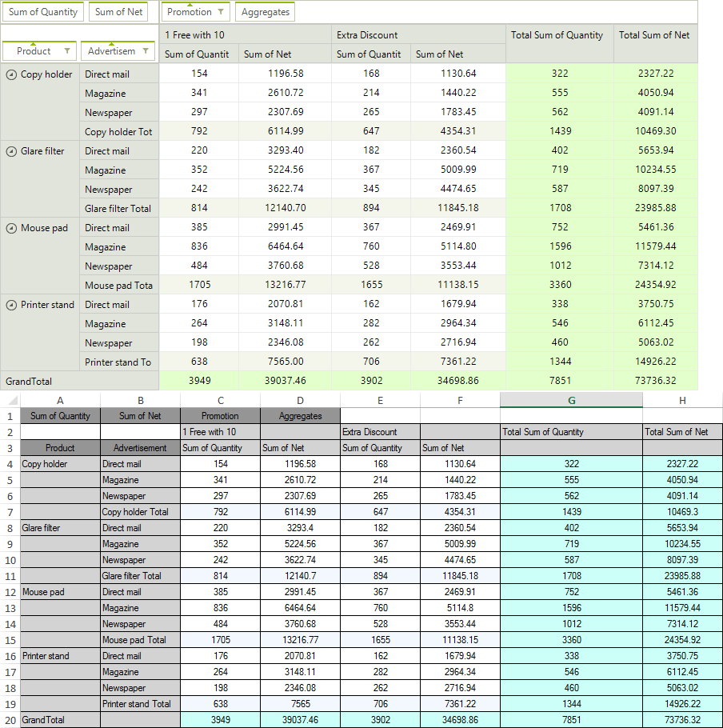
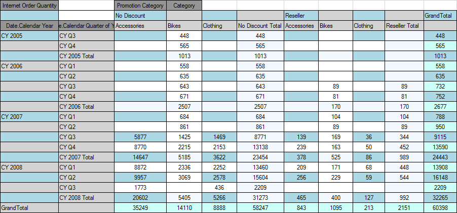

# Spread Export

__PivotGridSpreadExport__ utilizes our [RadSpreadProcessing](http://docs.telerik.com/devtools/document-processing/libraries/radspreadprocessing/overview) libraries to export the contents of __RadPivotGrid__ to *xlsx, csv, pdf* and *txt* formats. This article will explain in detail the spread export abilities and will demonstrate how to use it.

* [Exporting Data](#exporting-data)

* [Properties](#properties)

* [Events](#events)

Here is how the following grid, looks when exported.
      
>caption Figure 1: Exporting RadPivotGrid



>note The spread export functionality is located in the __TelerikExport.dll__ assembly.You need to include the following namespace in order to access the types contained in TelerikExport:
* Telerik.WinControls.TelerikExport
>

>important Since this functionality is using the [RadSpreadProcessingLibrary](http://docs.telerik.com/devtools/document-processing/libraries/radspreadprocessing/overview) you need to reference the following assemblies as well:
* Telerik.Windows.Documents.Core
* Telerik.Windows.Documents.Fixed
* Telerik.Windows.Documents.Spreadsheet
* Telerik.Windows.Documents.Spreadsheet.FormatProviders.OpenXml
* Telerik.Windows.Documents.Spreadsheet.FormatProviders.Pdf
* Telerik.Windows.Maths
* Telerik.Windows.Zip
>


## Exporting Data

To use the spread export functionality, an instance of the __PivotGridSpreadExport__ object should be created, passing as parameter the __RadPivotGrid__ instance to export. Afterwards, the __RunExport__ method will trigger the export process. Data can also be exported asynchronously, in order to take advantage of this feature, you should use the __RunExportAsync__ method instead. Both methods accepts as parameter a filename of the file to be exported and an instance of the __SpreadExportRenderer__ class.

#### Running Export Synchronously

{{source=..\SamplesCS\PivotGrid\PivotSpreadExport.cs region=ExportingData}} 
{{source=..\SamplesVB\PivotGrid\PivotSpreadExport.vb region=ExportingData}} 

````C#
            
PivotGridSpreadExport spreadExport = new PivotGridSpreadExport(this.radPivotGrid1);
spreadExport.RunExport(@"..\..\exported-file.xlsx", new SpreadExportRenderer());

````
````VB.NET
Dim spreadExport As New PivotGridSpreadExport(Me.RadPivotGrid1)
spreadExport.RunExport("..\..\exported-file.xlsx", New SpreadExportRenderer())

````

{{endregion}}

The __RunExport__ method has several overloads allowing the user to export using a stream as well:

####  Running Export Synchronously Using a Stream

{{source=..\SamplesCS\PivotGrid\PivotSpreadExport.cs region=StreamRunExport}} 
{{source=..\SamplesVB\PivotGrid\PivotSpreadExport.vb region=StreamRunExport}} 

````C#
            
string exportFile = @"..\..\exportedData.xlsx";
using (System.IO.MemoryStream ms = new System.IO.MemoryStream())
{
    Telerik.WinControls.Export.PivotGridSpreadExport exporter = new Telerik.WinControls.Export.PivotGridSpreadExport(this.radPivotGrid1);
    Telerik.WinControls.Export.SpreadExportRenderer renderer = new Telerik.WinControls.Export.SpreadExportRenderer();
    exporter.RunExport(ms, renderer);
    
    using (System.IO.FileStream fileStream = new System.IO.FileStream(exportFile, FileMode.Create, FileAccess.Write))
    {
        ms.WriteTo(fileStream);
    }
}

````
````VB.NET
Dim exportFile As String = "..\..\exportedData.xlsx"
Using ms As New System.IO.MemoryStream()
    Dim exporter As New Telerik.WinControls.Export.PivotGridSpreadExport(Me.RadPivotGrid1)
    Dim renderer As New Telerik.WinControls.Export.SpreadExportRenderer()
    exporter.RunExport(ms, renderer)
    Using fileStream As New System.IO.FileStream(exportFile, FileMode.Create, FileAccess.Write)
        ms.WriteTo(fileStream)
    End Using
End Using

````

{{endregion}} 

#### Running Export Asynchronously

{{source=..\SamplesCS\PivotGrid\PivotSpreadExport.cs region=ExportingDataAsync}} 
{{source=..\SamplesVB\PivotGrid\PivotSpreadExport.vb region=ExportingDataAsync}} 

````C#
PivotGridSpreadExport spreadExport = new PivotGridSpreadExport(this.radPivotGrid1);
spreadExport.RunExportAsync(@"..\..\exported-file.xlsx", new SpreadExportRenderer());

````
````VB.NET
Dim spreadExport As New PivotGridSpreadExport(Me.RadPivotGrid1)
spreadExport.RunExportAsync("..\..\exported-file.xlsx", New SpreadExportRenderer())

````

{{endregion}}

The __RunExportAsync__ method has several overloads allowing the user to export using a stream as well:

#### Running Export Asynchronously Overloads

{{source=..\SamplesCS\PivotGrid\PivotSpreadExport.cs region=StreamRunExportAsync}} 
{{source=..\SamplesVB\PivotGrid\PivotSpreadExport.vb region=StreamRunExportAsync}} 

````C#
        
private void buttonRunExportAsync_Click(object sender, EventArgs e)
{
    System.IO.MemoryStream ms = new System.IO.MemoryStream();         
    Telerik.WinControls.Export.PivotGridSpreadExport exporter = new Telerik.WinControls.Export.PivotGridSpreadExport(this.radPivotGrid1);
    Telerik.WinControls.Export.SpreadExportRenderer renderer = new Telerik.WinControls.Export.SpreadExportRenderer();
    exporter.AsyncExportCompleted += exporter_AsyncExportCompleted;
    exporter.RunExportAsync(ms, renderer);
}
        
private void exporter_AsyncExportCompleted(object sender, AsyncCompletedEventArgs e)
{
    RunWorkerCompletedEventArgs args = e as RunWorkerCompletedEventArgs;
    string exportFile = @"..\..\exportedAsyncData.xlsx";
    using (System.IO.FileStream fileStream = new System.IO.FileStream(exportFile, FileMode.Create, FileAccess.Write))
    { 
        MemoryStream ms = args.Result as MemoryStream;
        ms.WriteTo(fileStream);
        ms.Close();
    }
}

````
````VB.NET
Private Sub buttonRunExportAsync_Click(sender As Object, e As EventArgs)
    Dim ms As New System.IO.MemoryStream()
    Dim exporter As New Telerik.WinControls.Export.PivotGridSpreadExport(Me.RadPivotGrid1)
    Dim renderer As New Telerik.WinControls.Export.SpreadExportRenderer()
    AddHandler exporter.AsyncExportCompleted, AddressOf exporter_AsyncExportCompleted
    exporter.RunExportAsync(ms, renderer)
End Sub
Private Sub exporter_AsyncExportCompleted(sender As Object, e As AsyncCompletedEventArgs)
    Dim args As RunWorkerCompletedEventArgs = TryCast(e, RunWorkerCompletedEventArgs)
    Dim exportFile As String = "..\..\exportedAsyncData.xlsx"
    Using fileStream As New System.IO.FileStream(exportFile, FileMode.Create, FileAccess.Write)
        Dim ms As MemoryStream = TryCast(args.Result, MemoryStream)
        ms.WriteTo(fileStream)
        ms.Close()
    End Using
End Sub

````

{{endregion}} 

## Properties

__ExportFormat__: Defines the format the grid will be exported to. The available values are __Xslx, Pdf, Csv, Txt__. The default value of the property is __Xslx__, hence if not other specified, the exporter will export to __Xslx__.

__ExportVisualSettings__: Allows you to export the visual settings (themes) to the exported file. RadGridView will also export all formatting to the Excel file. The column width and row height will also be matched in the exported file.

__SheetMaxRows__: Тhe exporter splits the data on separate sheets if the number of rows is greater than the Excel maximum. You can control the maximum number of rows through this SheetMaxRows property. Available options are:

* *1048576*: Max rows for Excel 2007 and above

* *65536 (default)*: Max rows for previous versions of Excel. This is the default setting.

__SheetName__: Defines the sheet name of the sheet to export to. If your data is large enough to be split on more than one sheets, then the export method adds index to the names of the next sheets.

__FileExportMode__: This property determines whether the data will be exported into an existing or a new file. If new is chosen and such exists it will be overridden. Available options are:

* *NewSheetInExistingFile*: This is the default selection and it will create a new sheet in an already existing file.

* *CreateOrOverrideFile*: Creates new or overrides an existing file.

__ExportFlatData__: Defines whether flat data (columns and rows) will be exported.

__ShowGridLines__: Indicates whether the grid lines will be exported.

__ExportSelectionOnly__: Indicates whether to export only the current selection.

The following properties define color and font of the different cell elements: __CellBackColor__, __HeadersBackColor__, __DescriptorsBackColor__, __SubTotalsBackColor__,  __GrandTotalsBackColor__ __BorderColor__, __HeaderCellsFont__, __DataCellsFont__.

## Events

__CellFormatting__: This event is used to format the cells to be exported. The event arguments provide: 

* *Cell*: Provides access to the pivot spread cell element. 

* *ColumnIndex*: Returns the index of the column to be exported. 

* *ColumnsCount*: Returns the count of the columns to be exported. 

* *RowIndex*: Returns the index of the row to be exported. 

* *RowsCount*: Returns the count of the rows to be exported. 

This is how the displayed in Fig. 1 pivot grid looks after handling the __CellFormatting__ event.
        
>caption Figure 2: Applying Styles


#### CellFormatting Event

{{source=..\SamplesCS\PivotGrid\PivotSpreadExport.cs region=Events}} 
{{source=..\SamplesVB\PivotGrid\PivotSpreadExport.vb region=Events}} 

````C#
    
private void spreadExport_CellFormatting(object sender, PivotGridSpreadExportCellFormattingEventArgs e)
{
    if (e.ColumnIndex % 2 == 0 && e.RowIndex % 2 != 0)
    {
        e.Cell.BackColor = Color.LightBlue;
        e.Cell.ForeColor = Color.Black;
        e.Cell.BorderColor = Color.Black;
    }
}

````
````VB.NET
Private Sub spreadExport_CellFormatting(sender As Object, e As PivotGridSpreadExportCellFormattingEventArgs)
    If e.ColumnIndex Mod 2 = 0 AndAlso e.RowIndex Mod 2 <> 0 Then
        e.Cell.BackColor = Color.LightBlue
        e.Cell.ForeColor = Color.Black
        e.Cell.BorderColor = Color.Black
    End If
End Sub

````

{{endregion}}

__WorkbookCreated__:  This event is triggered on the __SpreadExportRenderer__ object when the workbook is ready to be exported. Allows to introduce final customizations.

* *Workbook*: Provides access to the exported Workbook object.

__AsyncExportProgressChanged__: Occurs when the progress of an asynchronous export operation changes.

__AsyncExportCompleted__: Occurs when an async export operation is completed.

# See Also

* [Export to PDF]()