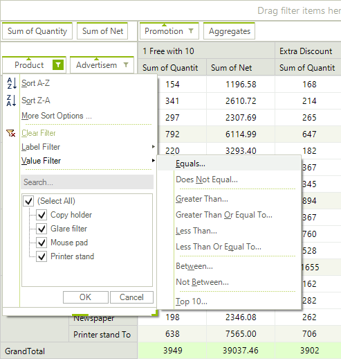

# Group Filters

Group filtering allows you to add filter conditions to the group descriptions. These conditions specify which of the generated groups will be displayed. There are two types of group filters: __Label filters__ and __Value filters__. The Label filters apply a specified filter function to the name of the generated groups whereas the Value filters apply a filter function to the __GrandTotal__ value of a given aggregate field for that group. <br>

Group filtering is enabled by default. To enable or disable it use the following property:

{{source=..\SamplesCS\PivotGrid\Filtering\PivotGridGroupFiltering.cs region=AllowGroupFiltering}} 
{{source=..\SamplesVB\PivotGrid\Filtering\PivotGridGroupFiltering.vb region=AllowGroupFiltering}} 

````C#
this.radPivotGrid1.AllowGroupFiltering = true;

````
````VB.NET
Me.radPivotGrid1.AllowGroupFiltering = True

````

{{endregion}}

The end-user can apply group filters using the filter button in the group descriptor elements or via the drop-down menus of the group fields in [RadPivotFieldList](). The filtering options are similar to the options of the __Report Filters__ with the addition of the __Top10 value filters__.  The Top10 filters allow you to select only the top/bottom groups from the order sorted by a given group value.

## Adding a group filter description

Group filters can be applied to group descriptions by using their __GroupFilter__ property as demonstrated in the following code snippet:

{{source=..\SamplesCS\PivotGrid\Filtering\PivotGridGroupFiltering.cs region=PropertyGroupDescription}} 
{{source=..\SamplesVB\PivotGrid\Filtering\PivotGridGroupFiltering.vb region=PropertyGroupDescription}} 

````C#
PropertyGroupDescriptionBase description = (PropertyGroupDescriptionBase)this.radPivotGrid1.RowGroupDescriptions[0];
LabelGroupFilter filter = new LabelGroupFilter();
ComparisonCondition condition = new ComparisonCondition();
condition.Condition = Telerik.Pivot.Core.Filtering.Comparison.Equals;
condition.Than = "UK"; 
filter.Condition = condition; 
description.GroupFilter = filter;

````
````VB.NET
Dim description As PropertyGroupDescriptionBase = Me.radPivotGrid1.RowGroupDescriptions(0)
Dim filter As New LabelGroupFilter()
Dim condition As New ComparisonCondition()
condition.Condition = Telerik.Pivot.Core.Filtering.Comparison.Equals
condition.Than = "UK"
filter.Condition = condition

````

{{endregion}}